This module is a work in progress. Proceed at your own risk!

# Azure Functions #
In this module, we will replace the e-mail functionality from Module 3 with an Azure Function in order to demonstrate a more decomposed, event-driven architecture leveraging an extremely scalable and affordable serverless platform. In Module 3, an confirmation email is sent to the submitter via an asynchronous call in the "Create" method of the IncidentController. This mechanism works for the initial email upon incident creation, but would be difficult to extend to handle other events such as when an incident is updated, assigned for implementation, or closed. Similarly, this architecture would make it quite difficult to resend emails that originate during a partial outage, such as if the Office 365 mailservers or their network access were temporarily unavailable. In the architecture we will use for this module, email functionality will be moved to an Azure Function. This function will be triggered by CosmosDB events, such as the initial DB population by the City, Power, and Lights (CPL) web application, but could include other applications/components updating the DB. As the Azure Function will not have access to the submitter's authentication token, we will use SendGrid's mail API instead of Office 365. 
(TODO: insert architecture diagram)

****************************************
## Exercise 1: SendGrid Prerequisites ##
In this exercise, we will sign up for a SendGrid mail API free account.
  
### 1. Sign up for a SendGrid Trial ###
Open a browser, and navigate to https://www.sendgrid.com. Click on "Try for Free".  
  
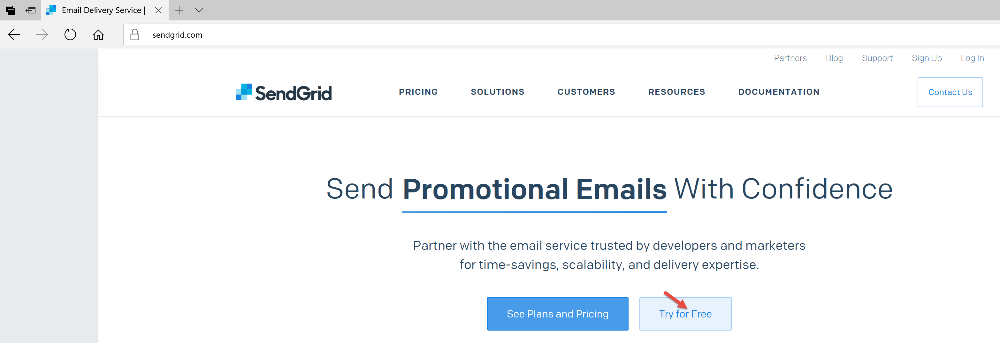

### 2. Create your SendGrid account ###
Configure your trial account as follows:  
* Make sure you are signing up for the free trial in the top-right
* Username: azuredevcamp-{yourname}
* Password: create a strong password that you will remember
* E-mail address: Provide an email address you have access to. Note: this could be an address in your Office 365 trial tenant. 
Prove you're not a robot, and click on "Create Account"

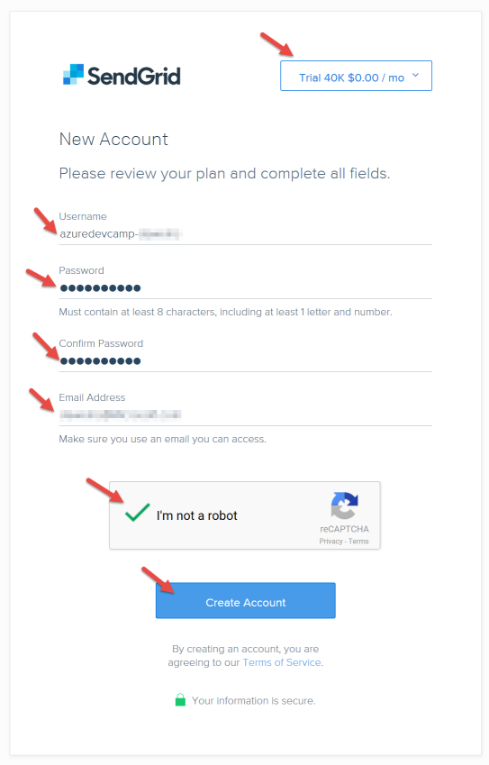

### 3. Login ###
Enter the username & password you just created.  
  
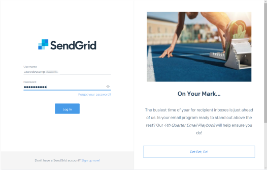  
  
Fill out SendGrid's survey
  
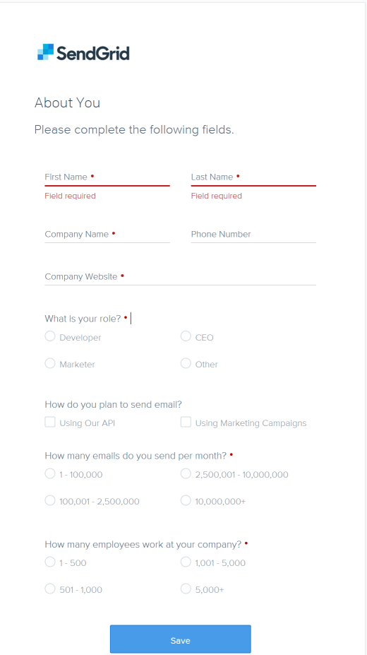    

You should soon receive a confirmation email sent to the address you provided in step 2. If desired, click on its provided link to verify your e-mail address. Otherwise, you will be limited to 100 emails per day. 

### 4. Create an API key ###
At the welcome screen, choose to "Integrate using the Web API"  
  
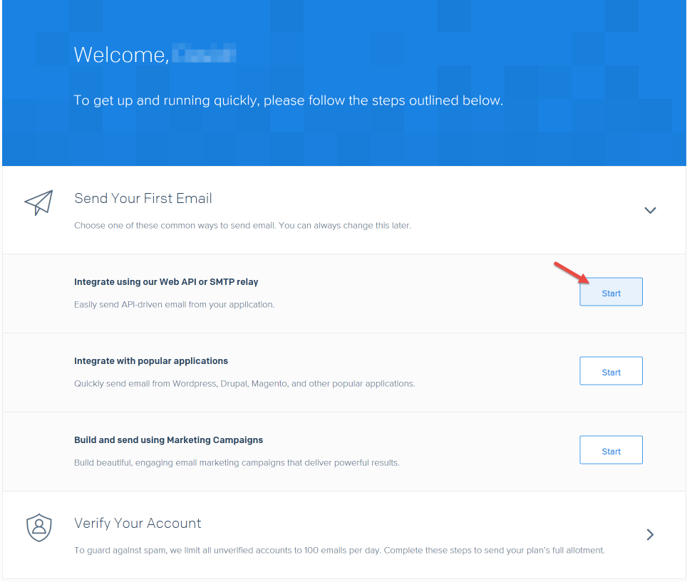    
  
On the next screen, choose to integrate with a Web API

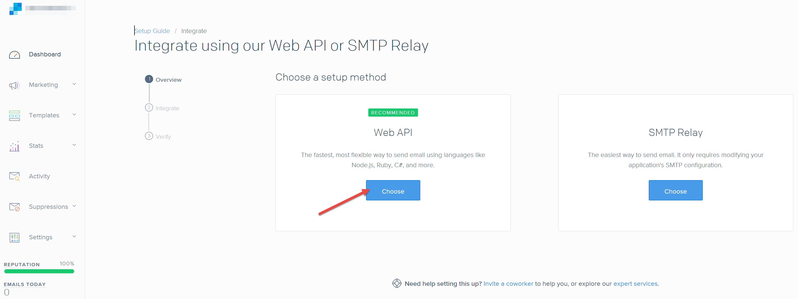    

Choose a language - this selection should not matter, as we will not be using the sample code. C# is a good choice.
 
Type in azuredevcamp as your API name, and click "Create Key"    
  
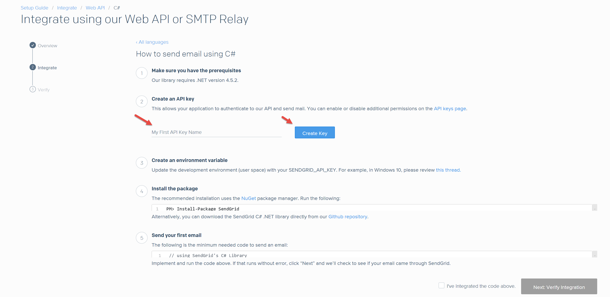    
  
Copy the returned API Key somewhere safe - we'll want to paste it in later when we configure our Azure Function.    
  
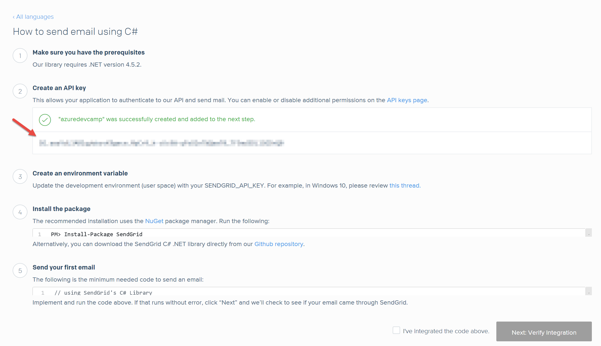    

****************************************
## Exercise 2: Gather your CosmosDB information  
  
### 1. Navigate to CosmosDB ###
Open a separate browser window and navigate to https://portal.azure.com, then to the DevCamp resource group. Click on the Azure Cosmos DB account beginning with incident. 

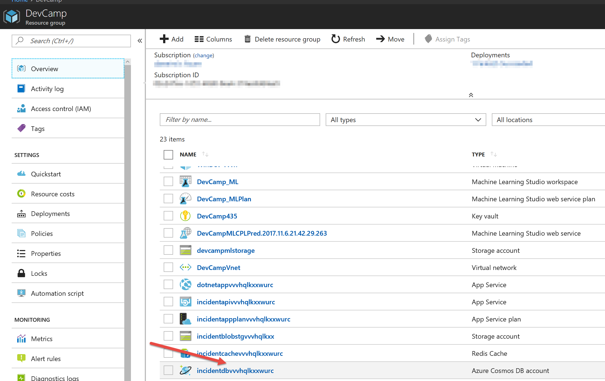  

### 2. Open Data Explorer ###
Click on "Data Explorer"
  
  

### 3. Gather information and ensure you have sample data ###  
Take note of your Database name and Collection Name - we'll need it later. Click on the "Documents" label under the "incidents" collection.  
  
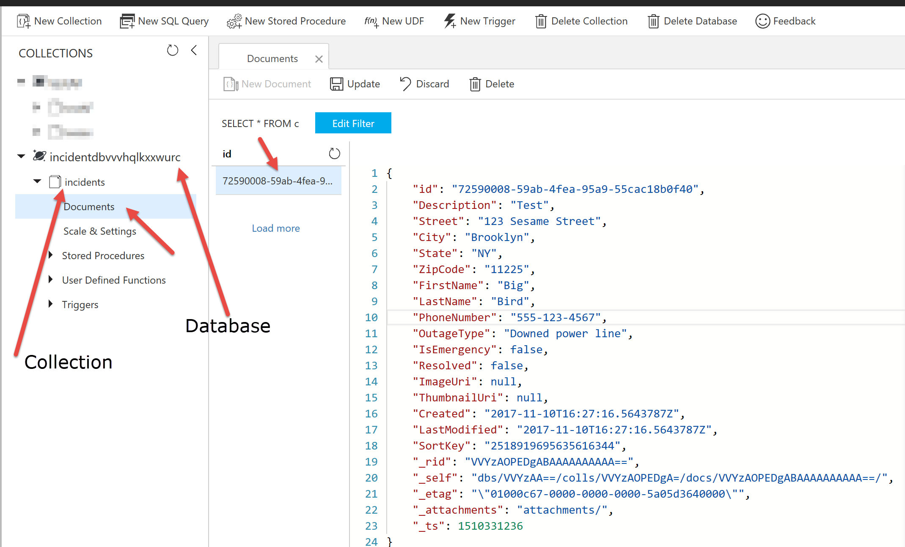  
  
If you completed earlier exercises, you probably have sample incidents already in place, which you can examine by clicking on their id. If not, click "New Document" and create a dummy record with information similar to:  
   
    {  
        "id": "72590008-59ab-4fea-95a9-55cac18b0f40",  
        "Description": "Test",  
        "Street": "123 Sesame Street",  
        "City": "Brooklyn",  
        "State": "NY",  
        "ZipCode": "11225",  
        "FirstName": "Big",  
        "LastName": "Bird",  
        "PhoneNumber": "555-123-4567",  
        "OutageType": "Downed power line",  
        "IsEmergency": false,  
        "Resolved": false,  
        "ImageUri": null,  
        "ThumbnailUri": null,  
        "Created": "2017-11-10T16:27:16.5643787Z",  
        "LastModified": "2017-11-10T16:27:16.5643787Z",  
        "SortKey": "2518919695635616344",  
        "_rid": "VVYzAOPEDgABAAAAAAAAAA==",  
        "_self": "dbs/VVYzAA==/colls/VVYzAOPEDgA=/docs/VVYzAOPEDgABAAAAAAAAAA==/",  
        "_etag": "\"01000c67-0000-0000-0000-5a05d3640000\"",  
        "_attachments": "attachments/",  
        "_ts": 1510331236  
    }   
  
  
Leave this browser window open, as we'll use it later. 
  
****************************************
## Exercise 3: Azure Function Creation ##  
In this exercise, we will create our Azure Function, and configure it to watch for CPL Incident related CosmosDB events. 

### 1. Login to the Azure Portal ###  
Navigate to https://portal.azure.com. Login if necessary. Navigate to the DevCamp Resource Group.

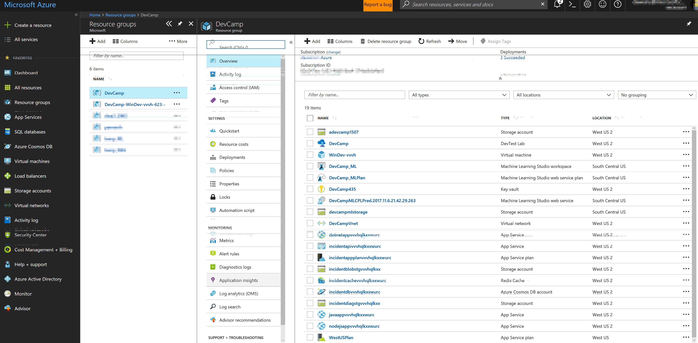  

### 2. Create your Function App
Click on "Add" in the top left of the DevCamp Resource Group blade. Search for "function", and add a "Function App". Click on "Create" in the blade that appears to the right. 
  
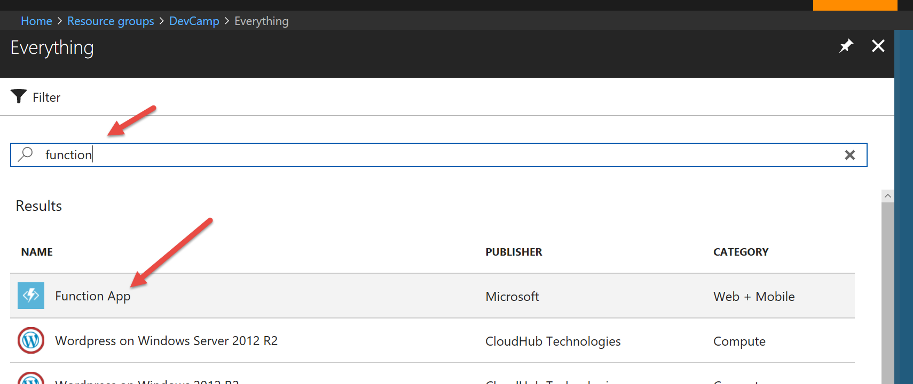  

### 3. Configure your Function App
Configure your function as follows:  
* App name: This must be unique across Azure, so name it as follows: {yourname}devcampincidentnotification
* Subscription: Use the same subscription as the rest of devcamp
* Resource Group: Use the existing devcamp resource group
* Hosting Plan: Consumption Plan: we can utilize the cheaper "Consumption Plan" model as we have very low -> no performance requirements for this function. 
* Location: Same as the rest of your devcamp
* Storage: Create a new storage account. Name it something you'll recognize, or use the default name

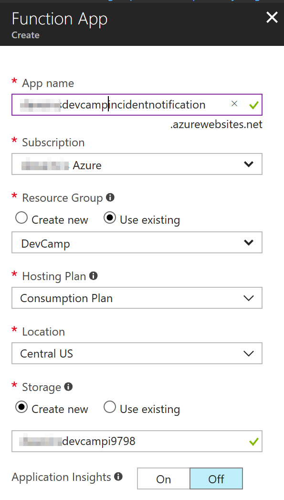  

### 4. Create your function and attach it to CosmosDB  
Wait for the deployment of your Function App to complete (using the Notifications "bell" icon in the top right toolbar). Once it has completed, return to the DevCamp resource group, and observe your newly created Function and its associated storage account. Click on the Function App (look for the lightning icon).
  
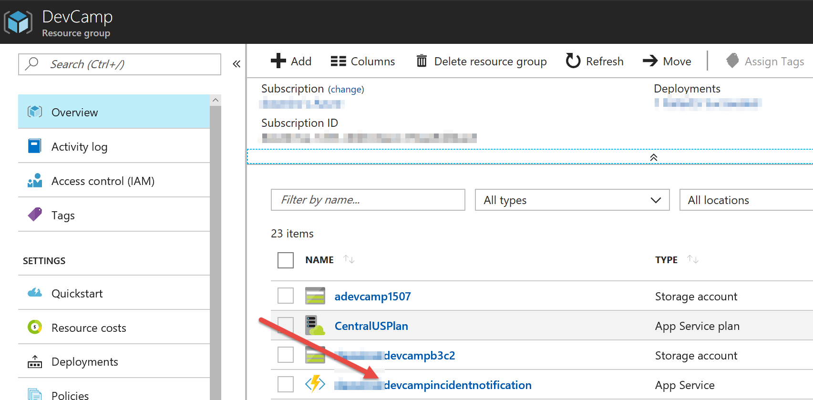  
  
Click on the plus sign next to "Functions" to create a new Function within your Function App. 
  
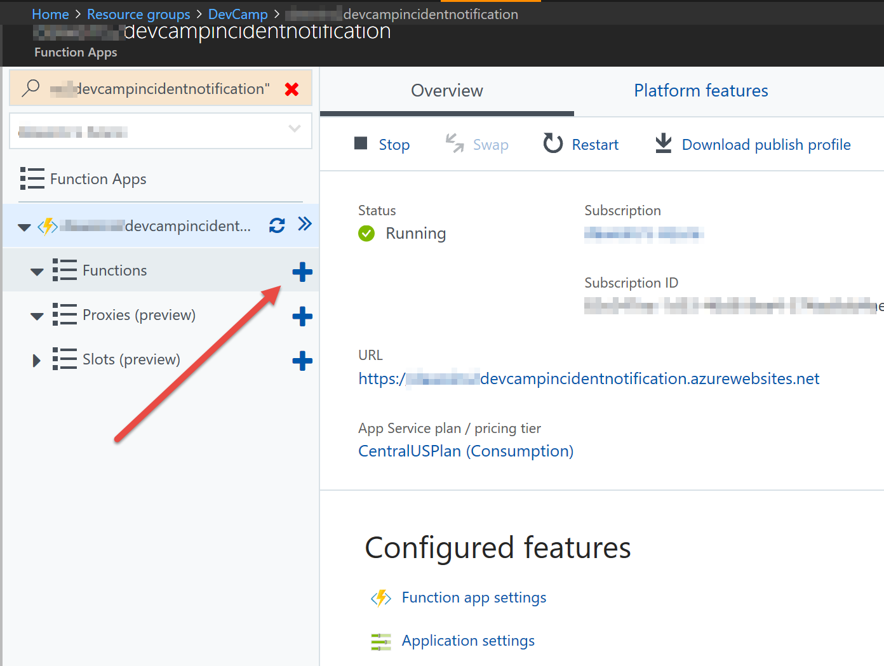  
  
We'll be creating a "Custom Function" to tie into CosmosDB - look for this option near the bottom of the blade.  
  
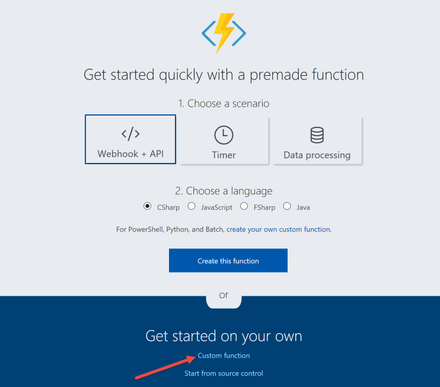  
  
Scroll down (to the bottom) of the function templates, and choose "CosmosDBTrigger - C#"
  
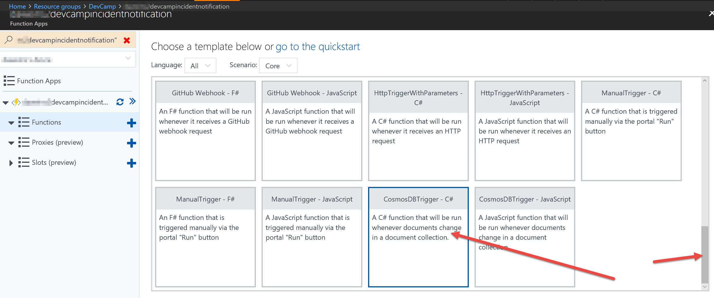  

Scroll down and name your function "CPLIncidentEventHandler". Click on the "new" button/label next to the textbox for "Azure Cosmos DB account connection", and select the DocumentDB (CosmosDB) Account created with the original DevCamp template beginning with "incidentdb"

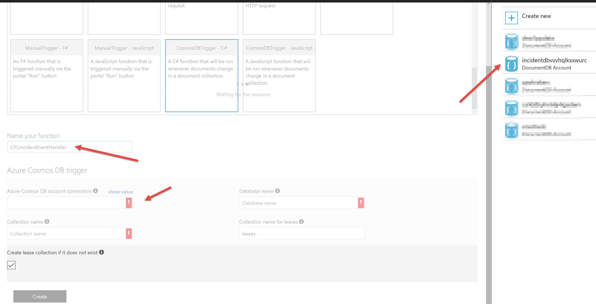  

Enter your Database and Collection names from Exercise 2. Leave the lease information with default values. 

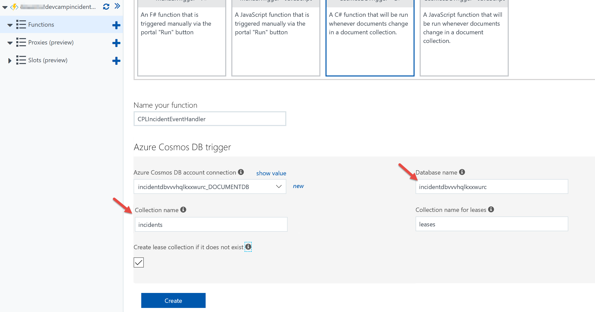  
  
### 5. Checkpoint - Test CosmosDB Integration
You should now have a function ready with enough code to test. Add a log message "Hello World" if you are feeling ambitious. Leave the existing log messages in place - they are relevant for our app. Note that the sample log messages are at the "Verbose" level, and will not appear in our log trace by default. For normal development, we could change our logging level in host.json, but to keep things simple for this HOL, change the log levels to Info instead.  Save your function and expand the log window at the bottom. 
  
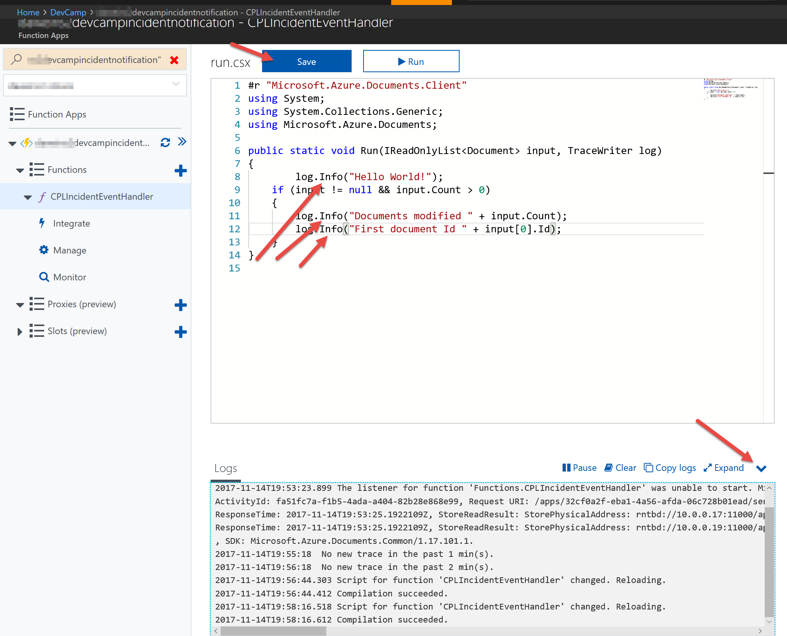  
  
Trigger a CosmosDB event. You can do this in one of 3 ways:
* Use the CPL web app to create a new incident
* In the CosmosDB Data Explorer browser window we left open from Exercise 2, add a new document using the snippet from Exercise 2
* In the CosmosDB Data Explorer browser window we left open from Exercise 2, alter and save an existing document
  
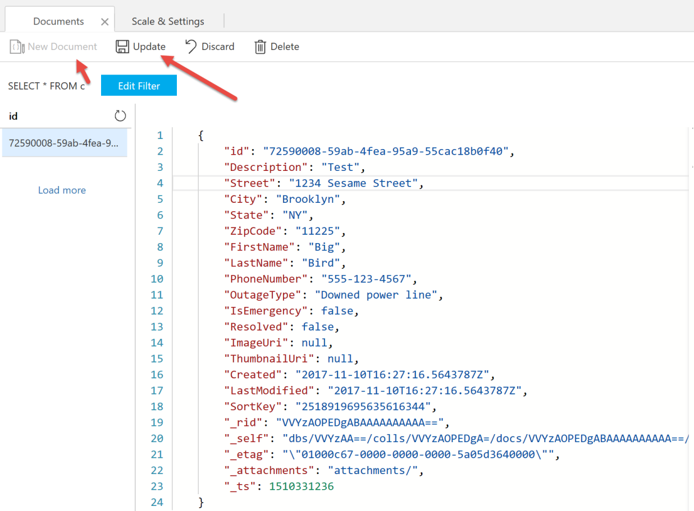  
  
Switch back to your Function, and look at the log - you should see evidence that it ran successfully, and read the id of your test Document. 
  
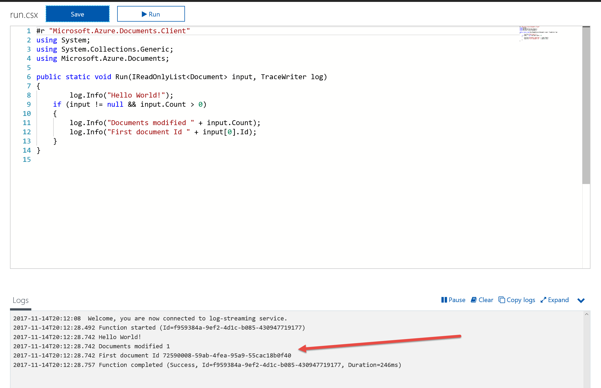  
  

****************************************
## Exercise 3: Azure Function Logic & SendGrid Mail Integration
In this exercise, we will add logic to our Azure Function to read from the CosmosDB documents generating the events, and to send an appropriate e-mail.  

### 1. Capture document properties as variables and assemble the mail components ###
In order to prepare our message, we will need to make a few changes:
* Change the starter code to loop over multiple documents. As this is an event driven system, if we have many users, multiple changes will be sent in a single batch rather than many messages. We need to make sure we process them all
* Capture the document properties as variables so we can work with them. Document properties can be retrieved with the GetPropertyValue<T> method
* Compose the mail components (Title, Body, From, To)
* Log the mail components so we can make sure it works. 

Make the code changes yourself if you are comfortable, or copy/paste the code from below: 

    #r "Microsoft.Azure.Documents.Client"
    using System;
    using System.Collections.Generic;
    using Microsoft.Azure.Documents;

    public static void Run(IReadOnlyList<Document> input, TraceWriter log)
    {
        log.Info("Hello World!");
        log.Info("Documents modified " + input.Count);
        if (input != null)
        {
            for(int curDocNum = 0; curDocNum < input.Count; curDocNum++)
            {
                try
                {
                    log.Info("Document Id " + input[curDocNum].Id);
                    
                    string curDocDescription    = input[curDocNum].GetPropertyValue<string>("Description");
                    string curDocStreet         = input[curDocNum].GetPropertyValue<string>("Street");
                    string curDocCity           = input[curDocNum].GetPropertyValue<string>("City");
                    string curDocState          = input[curDocNum].GetPropertyValue<string>("State");
                    string curDocZip            = input[curDocNum].GetPropertyValue<string>("ZipCode");
                    string curDocFirstName      = input[curDocNum].GetPropertyValue<string>("FirstName");
                    string curDocLastName       = input[curDocNum].GetPropertyValue<string>("LastName");
                    //string curDocCreatedString  = input[curDocNum].GetPropertyValue<string>("Created");
                    DateTime curDocCreated  = input[curDocNum].GetPropertyValue<DateTime>("Created");
                    //DateTime curDocCreated = Convert.ToDateTime(curDocCreatedString);

                    string mailTitle = String.Format("{0} {1}, Thank you for submitting your incident to City, Power and Lights", curDocFirstName, curDocLastName);
                    string mailBody  = String.Format(@"We have received your incident report: 
                                                        Description: {0}
                                                        Street: {1}
                                                        City: {2} 
                                                        State: {3} 
                                                        Zip: {4} 
                                                        Reported by: {5} {6} 
                                                        Reported on: {7} 
                                                        
                                                        We will provide updates as progress is made. 
                                                        Please contact 555-123-4567 or citypowerlights@contoso.com for any questions
                                                        
                                                        Thank you,
                                                        City, Power, and Lights
                                                        ", curDocDescription, curDocStreet, curDocCity, curDocState, curDocZip, curDocFirstName, curDocLastName, curDocCreated.ToString("MM/dd/yyyy"));
                    string mailFrom     = "citypowerlights@contoso.com";
                    string mailTo       = "bob@bob.com"; // Your address goes here

                    log.Info(String.Format("Mail content ready: Title: {0}\nBody: {1}\nFrom: {2}\nTo: {3}",mailTitle,mailBody,mailFrom,mailTo ));
                }
                catch(Exception err)
                {
                    log.Info("Error sending mail fo document" + input[curDocNum].Id + ": " + err.ToString());
                }
            
            }

        }
    }

Save your function, and re-trigger a test using your CosmosDB Data Explorer (hopefully still open in another browser window) to update or create a new Document. Check your log to make sure your mail components were created properly. 

### 2. Configure your Code to Output Mail  ###
If our Function was expected to only send one message per execution, we could leverage the SendGrid integration with Azure Function's Output bindings. See https://docs.microsoft.com/en-us/azure/azure-functions/functions-how-to-use-sendgrid for details on this mechanism. However, since we have to expect that we may need to process multiple Document changes in each execution (remember our for-loop), we'll use SendGrid's C# API to send the messages directly. 

Click on your Function CPLIncidentEventHandler to view the code. 
* First, add a reference to the SendGrid assembly. We can do this with a #r directive at the top of our code:
    #r "SendGrid"
* Next, we can use standard "using" statements to ease our use in our code:
    using SendGrid;
    using SendGrid.Helpers.Mail;
* Add a helper function to send the mail message using SendGrid  
  
       public static async Task SendMail(TraceWriter log, string mailFromString, string mailToString,string mailTitle, string mailBodyString)
        {
            string apiKey = Environment.GetEnvironmentVariable("SendGridKey");
            var mailClient = new SendGridAPIClient(apiKey);
            Email mailFrom = new Email(mailFromString);
            Email mai   lTo = new Email(mailToString);
            Content mailBody= new Content("text/plain", mailBodyString);
            Mail mailMessage = new Mail (mailFrom,mailTitle,mailTo, mailBody);
            var response = await mailClient.client.mail.send.post(requestBody: mailMessage.Get());
            log.Info($"response.StatusCode: {response.StatusCode}");
            log.Info($"response.Body.ReadAsStringAsync().Result: {response.Body.ReadAsStringAsync().Result}");
            log.Info($"response.Headers.ToString(): {response.Headers.ToString()}");
        }  
  
* Add code to actually send the mail into our main Run function, underneath the line where we logged that we were ready to send mail
  
      log.Info(String.Format("Mail content ready: Title: {0}\nBody: {1}\nFrom: {2}\nTo: {3}",mailTitle,mailBody,mailFrom,mailTo )); //This line should already be present in your code

      SendMail(log,mailFrom,mailTo,mailTitle,mailBody).Wait();
      log.Info("Mail sent!");

Overall, your Function's entire code should now be:
  
    #r "Microsoft.Azure.Documents.Client"
    #r "SendGrid"
    using System;
    using System.Collections.Generic;
    using Microsoft.Azure.Documents;
    using SendGrid;
    using SendGrid.Helpers.Mail;

    public static void Run(IReadOnlyList<Document> input, TraceWriter log)
    {
        log.Info("Hello World!");
        log.Info("Documents modified " + input.Count);
        if (input != null)
        {
            for(int curDocNum = 0; curDocNum < input.Count; curDocNum++)
            {
                try
                {
                    log.Info("Document Id " + input[curDocNum].Id);
                    
                    string curDocDescription    = input[curDocNum].GetPropertyValue<string>("Description");
                    string curDocStreet         = input[curDocNum].GetPropertyValue<string>("Street");
                    string curDocCity           = input[curDocNum].GetPropertyValue<string>("City");
                    string curDocState          = input[curDocNum].GetPropertyValue<string>("State");
                    string curDocZip            = input[curDocNum].GetPropertyValue<string>("ZipCode");
                    string curDocFirstName      = input[curDocNum].GetPropertyValue<string>("FirstName");
                    string curDocLastName       = input[curDocNum].GetPropertyValue<string>("LastName");
                    //string curDocCreatedString  = input[curDocNum].GetPropertyValue<string>("Created");
                    DateTime curDocCreated  = input[curDocNum].GetPropertyValue<DateTime>("Created");
                    //DateTime curDocCreated = Convert.ToDateTime(curDocCreatedString);

                    string mailTitle = String.Format("{0} {1}, Thank you for submitting your incident to City, Power and Lights", curDocFirstName, curDocLastName);
                    string mailBody  = String.Format(@"We have received your incident report: 
                                                        Description: {0}
                                                        Street: {1}
                                                        City: {2} 
                                                        State: {3} 
                                                        Zip: {4} 
                                                        Reported by: {5} {6} 
                                                        Reported on: {7} 
                                                        
                                                        We will provide updates as progress is made. 
                                                        Please contact 555-123-4567 or citypowerlights@contoso.com for any questions
                                                        
                                                        Thank you,
                                                        City, Power, and Lights
                                                        ", curDocDescription, curDocStreet, curDocCity, curDocState, curDocZip, curDocFirstName, curDocLastName, curDocCreated.ToString("MM/dd/yyyy"));
                    string mailFrom     = "citypowerlights@contoso.com";
                    string mailTo       = "bob@bob.com"; // Your address goes here

                    log.Info(String.Format("Mail content ready: Title: {0}\nBody: {1}\nFrom: {2}\nTo: {3}",mailTitle,mailBody,mailFrom,mailTo ));

                    SendMail(log,mailFrom,mailTo,mailTitle,mailBody).Wait();
                    log.Info("Mail sent!");
                }
                catch(Exception err)
                {
                    log.Info("Error sending mail fo document" + input[curDocNum].Id + ": " + err.ToString());
                }
            }

        }
    }
    public static async Task SendMail(TraceWriter log, string mailFromString, string mailToString,string mailTitle, string mailBodyString)
    {
            string apiKey = Environment.GetEnvironmentVariable("SendGridKey");
            var mailClient = new SendGridAPIClient(apiKey);
            Email mailFrom = new Email(mailFromString);
            Email mailTo = new Email(mailToString);
            Content mailBody= new Content("text/plain", mailBodyString);
            Mail mailMessage = new Mail (mailFrom,mailTitle,mailTo, mailBody);
            var response = await mailClient.client.mail.send.post(requestBody: mailMessage.Get());
            log.Info($"response.StatusCode: {response.StatusCode}");
            log.Info($"response.Body.ReadAsStringAsync().Result: {response.Body.ReadAsStringAsync().Result}");
            log.Info($"response.Headers.ToString(): {response.Headers.ToString()}");
    }

### 3. Save & Test ###
Save your code, then open up your CosmosDB browser window (or CPL application) and alter or create a new Incident Document. In your Function's window, observe the log to see that the message was sent correctly. Once it has, watch the inbox of the address you sent your mail to - if it doesn't show up, check your junk/unfocused folders. You can also login to SendGrid to view mail traffic sent through the API to aid in debugging if necessary.  

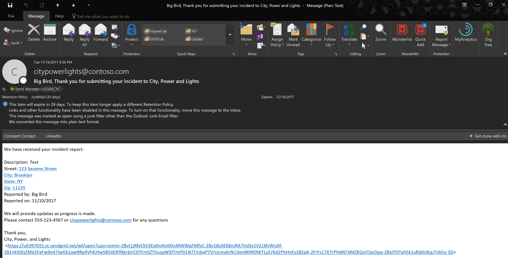  
  

****************************************
## Optional Extensions ##  
  
1. Add a status attribute to the CosmosDB records, and add logic to your Azure Function to only send the confirmation upon initial creation (and ideally, with logic to ensure the mail is only sent once per incident)   
2. Add an "e-mail" attribute to the CosmosDB record, and populate it in the IncidentController using the current user's address (or allow the user to enter their own address by adding a property to the creation form). Use this email attribute instead of the hard-coded address we used in this module. 
3. Add error checking to Exercise 3 - CosmosDB documents are unstructured, so a production quality application would have safety logic ensuring we get all fields we need and handling appropriately (default values or failing)

