# Hands on Lab - Identity with Azure AD and Office 365 APIs (.NET)

## Overview

City Power & Light is a sample application that allows citizens to to report "incidents" that have occurred in their community.  It includes a landing screen, a dashboard, and a form for reporting new incidents with an optional photo.  The application is implemented with several components:

* Front end web application contains the user interface and business logic.  This component has been implemented three times in .NET, NodeJS, and Java.
* WebAPI is shared across the front ends and exposes the backend DocumentDB
* DocumentDB is used as the data persistence layer 

In this lab, you will continue enhancing the City Power & Light application by adding authentication for users powered by [Azure Active Directory](https://azure.microsoft.com/en-us/services/active-directory/).  Once authenticated, you may then query the [Microsoft Office Graph](https://graph.microsoft.io) to retrieve information pertinent to the application.

> This guide use Visual Studio on Windows as the IDE. You can use [Visual Studio community Edition](https://www.visualstudio.com/post-download-vs/?sku=community&clcid=0x409&downloadrename=true).

## Objectives
In this hands-on lab, you will learn how to:

* Take an anonymous application and add user authentication via AzureAD
* Query data from the Microsoft Graph
* Manipulate data in the Microsoft Graph

## Prerequisites

* The source for the starter app is located in the [start](start) folder. 
* The finished project is located in the [end](end) folder. 
* Deployed the starter ARM Template [HOL 1](../developer-environment)
* Completion of the first [modern-cloud-apps lab](../modern-cloud-apps) 

> Note: If you did not complete the previous labs, the project in the start folder is cumulative.

## Exercises

This hands-on-lab has the following exercises:

* Exercise 1: Setup authentication 
* Exercise 2: Create a user profile page
* Exercise 3: Send a confirmation email to the user on incident creation

### Exercise 1: Regiser the application

AzureAD can handle authentication for web applications. First we will create a new application in our AzureAD directory, and then we will extend our application code to work with an authentication flow. 

1. Navigate in a browser to [https://apps.dev.microsoft.com](https://apps.dev.microsoft.com), click the button to **Register your app**, and login with your Azure credentials (Work or school Account).

    

1. There are several types of applications that can be registered. The registration of the .NET app is not listed here so skip the quickstart.

    

1. Click **Add an app** from the top menu
    
    

1. Provide an application name and click **Create Application**

    

1. On the Registration page, take note of the **Application ID**. This will be used as an environment variable named `AAD_CLIENT_ID` and is used to configure the authentication library.  

    We also need to generate a client secret. Select the **Generate New Password** button.

    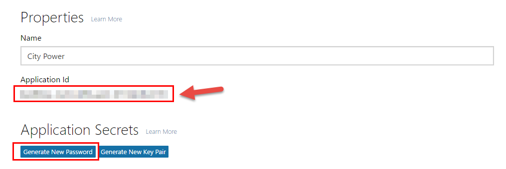

1. A key is generated for you. Save this, as you will not be able to retrieve it in the future. This key will become the `AAD_CLIENT_SECRET` environment variable.

    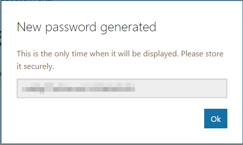

1. Click on the Add Platform button

    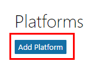

1. Select Web

    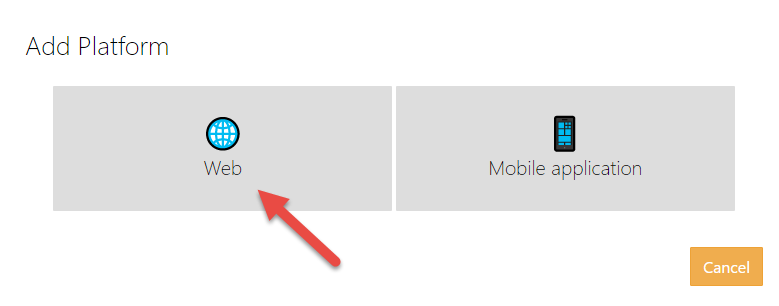

1. After AzureAD handles the authentication, it needs a location to redirect the user. For testing locally, we'll use the local IISExpress web site `http://localhost:8443` as the **Redirect URI** and set the URL as an app setting variable named `AAD_RETURN_URL`.This URL may need to be updated to the IISExpress dynamic port that is generated while debugging. Steps to update this are provided later in the lab.  

    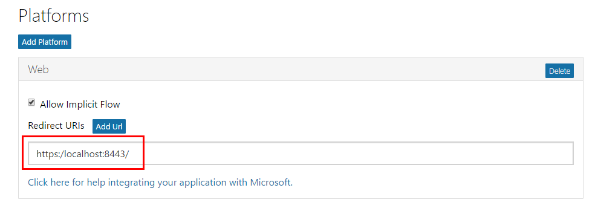

1. Click the **Save** button on the bottom of the screen.

      

1. Open the Visual Studio project file from the `start` folder

    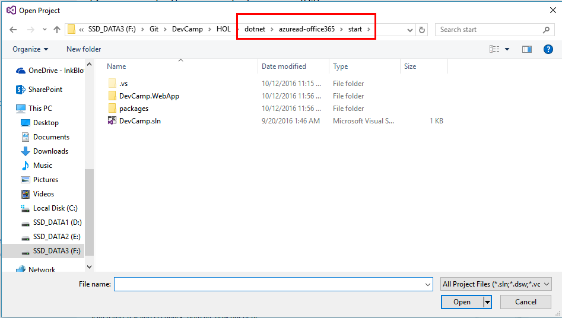

1. Build the project and press F5 to restore the nuget packages and start IISExpress. This will create the web application with the dynamic port.

1. Stop debugging. Right-click on the project and select `properties`

    
    
1. Go to the Web tab and take note of the IISExpress dynamic port. Update the URL to HTTPS and click save.

    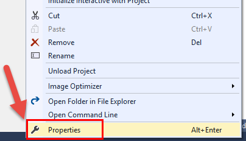

1. You should receive 2 prompts confirming the update.

    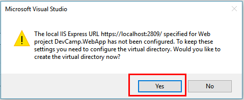

    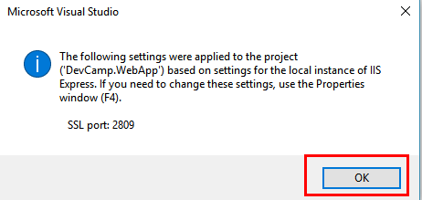

1. Open the web.config and update the settings with the values from the app registration screen:

    ```xml
   <!--HOL 3-->
    <add key="AAD_APP_ID" value="APPID" />
    <add key="AAD_APP_SECRET" value="SECRET" />
    <add key="AAD_APP_REDIRECTURI" value="LOCAL HTTPS IIS WEBSITE" />
    ```

1. Go back to the app registration screen and update the return URL with the new port and click save.

    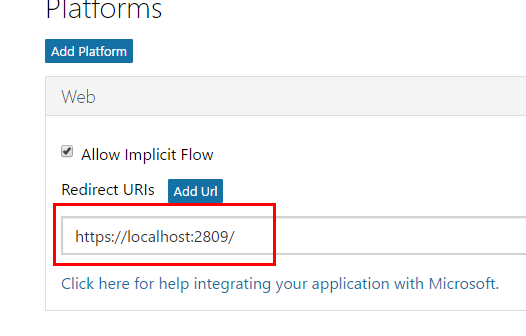

    

1. In Visual Studio, Add the following packages from nuget:

    > `Microsoft.IdentityModel.Clients.ActiveDirectory`
    >
    > `Microsoft.IdentityModel.Protocol.Extensions`
    >
    > `Microsoft.IdentityModel.Tokens`
    >
    > `Microsoft.Owin.Security.OpenIdConnect`
    >
    > `Microsoft.Owin.Security.Cookies`
    >
    > `Microsoft.Owin.Host.SystemWeb`

1. We need add code to handle the authentication and and cache the sessions tokens so we don't have to get them all time. Navigate to the Utils folder and create a 2 new helper class files. Create `AuthHelper.cs` and `SessionTokeCache.cs`

1. First let's update the Setting.cs class with the additional constants. Paste these values below the existing entries from HOL2.

    ```csharp
        // --- OMITTED ---

        //####    HOL 2    ######

        //####    HOL 3    ######
        public static string AAD_APP_ID = ConfigurationManager.AppSettings["AAD_APP_ID"];
        public static string AAD_INSTANCE = ConfigurationManager.AppSettings["AAD_INSTANCE"];
        public static string AAD_APP_REDIRECTURI = ConfigurationManager.AppSettings["AAD_APP_REDIRECTURI"];
        public static string AAD_TENANTID_CLAIMTYPE = "http://schemas.microsoft.com/identity/claims/tenantid";
        public static string AAD_OBJECTID_CLAIMTYPE = "http://schemas.microsoft.com/identity/claims/objectidentifier";
        public static string AAD_AUTHORITY = ConfigurationManager.AppSettings["AAD_AUTHORITY"];
        public static string AAD_LOGOUT_AUTHORITY = ConfigurationManager.AppSettings["AAD_LOGOUT_AUTHORITY"];
        public static string GRAPH_API_URL = ConfigurationManager.AppSettings["GRAPH_API_URL"];
        public static string AAD_APP_SECRET = ConfigurationManager.AppSettings["AAD_APP_SECRET"];
        public static string AAD_GRAPH_SCOPES = ConfigurationManager.AppSettings["AAD_GRAPH_SCOPES"];
        public static string GRAPH_CURRENT_USER_URL = GRAPH_API_URL + "/v1.0/me";
        public static string GRAPH_SENDMESSAGE_URL = GRAPH_CURRENT_USER_URL + "/sendMail";
        public static string SESSIONKEY_ACCESSTOKEN = "accesstoken";
        public static string SESSIONKEY_USERINFO = "userinfo";
        //####    HOL 3    ######
    ```

1. Open `AuthHelper.cs` and paste the following code. This code will obtain a token from Azure AD for users:

    ```csharp
    using System.Threading.Tasks;
    using System.Web;
    using Microsoft.IdentityModel.Clients.ActiveDirectory;
    using Microsoft.Owin.Security;
    using Microsoft.Owin.Security.OpenIdConnect;
    using System.IdentityModel.Claims;

    namespace DevCamp.WebApp.Utils
    {
        public class AuthHelper
        {
            // This is the logon authority
            // i.e. https://login.microsoftonline.com/common
            public string Authority { get; set; }
            // This is the application ID obtained from registering at
            // https://apps.dev.microsoft.com
            public string AppId { get; set; }
            // This is the application secret obtained from registering at
            // https://apps.dev.microsoft.com
            public string AppSecret { get; set; }
            // This is the token cache
            public SessionTokenCache TokenCache { get; set; }

            public AuthHelper(string authority, string appId, string appSecret, SessionTokenCache tokenCache)
            {
                Authority = authority;
                AppId = appId;
                AppSecret = appSecret;
                TokenCache = tokenCache;
            }

            public async Task<string> GetUserAccessToken(string redirectUri)
            {
                AuthenticationContext authContext = new AuthenticationContext(Authority, false, TokenCache);

                ClientCredential credential = new ClientCredential(AppId, AppSecret);

                try
                {
                    AuthenticationResult authResult = await authContext.AcquireTokenSilentAsync("https://graph.microsoft.com", credential,
                    new UserIdentifier(TokenCache.UserObjectId, UserIdentifierType.UniqueId));
                    return authResult.AccessToken;
                }
                catch (AdalSilentTokenAcquisitionException)
                {
                    HttpContext.Current.Request.GetOwinContext().Authentication.Challenge(
                    new AuthenticationProperties() { RedirectUri = redirectUri },
                    OpenIdConnectAuthenticationDefaults.AuthenticationType);

                    return null;
                }
            }
        }
    }
    ```

1. Open `SessionTokenCache.cs` and paste the following code. This code will handle the custom caching of tokens:

    ```csharp
    //Copyright (c) Microsoft. All rights reserved. Licensed under the MIT license.
    //See LICENSE in the project root for license information.

    using System.Web;
    using Newtonsoft.Json;
    using Microsoft.IdentityModel.Clients.ActiveDirectory;

    namespace DevCamp.WebApp.Utils
    {
        public class SessionTokenCache : TokenCache
        {
            private HttpContextBase context;
            private static readonly object FileLock = new object();
            private readonly string CacheId = string.Empty;
            public string UserObjectId = string.Empty;

            public SessionTokenCache(string userId, HttpContextBase context)
            {
                this.context = context;
                this.UserObjectId = userId;
                this.CacheId = UserObjectId + "_TokenCache";

                AfterAccess = AfterAccessNotification;
                BeforeAccess = BeforeAccessNotification;
                Load();
            }

            public void Load()
            {
                lock (FileLock)
                {
                    Deserialize((byte[])context.Session[CacheId]);
                }
            }

            public void Persist()
            {
                lock (FileLock)
                {
                    // reflect changes in the persistent store
                    var bytes = Serialize();
                    var x = System.Text.Encoding.UTF8.GetString(bytes);
                    context.Session[CacheId] = Serialize();
                    // once the write operation took place, restore the HasStateChanged bit to false
                    HasStateChanged = false;
                }
            }

            // Empties the persistent store.
            public override void Clear()
            {
                base.Clear();
                context.Session.Remove(CacheId);
            }

            public override void DeleteItem(TokenCacheItem item)
            {
                base.DeleteItem(item);
                Persist();
            }

            // Triggered right before ADAL needs to access the cache.
            // Reload the cache from the persistent store in case it changed since the last access.
            private void BeforeAccessNotification(TokenCacheNotificationArgs args)
            {
                Load();
            }

            // Triggered right after ADAL accessed the cache.
            private void AfterAccessNotification(TokenCacheNotificationArgs args)
            {
                // if the access operation resulted in a cache update
                if (HasStateChanged)
                {
                    Persist();
                }
            }
        }
    }
    ```

1. Right click on the App_Start folder and select **New > OWIN Startup Class**

    

1. Name it `Startup`. Once it is created, open the file, paste the following code. This will handle the initial authentication flow and cache the tokens:

    ```csharp
    using DevCamp.WebApp.App_Start;
    using DevCamp.WebApp.Utils;
    using Microsoft.IdentityModel.Protocols;
    using Microsoft.Owin;
    using Microsoft.Owin.Security;
    using Microsoft.Owin.Security.Cookies;
    using Microsoft.Owin.Security.Notifications;
    using Microsoft.Owin.Security.OpenIdConnect;
    using Owin;
    using System;
    using System.Globalization;
    using System.IdentityModel.Claims;
    using System.IdentityModel.Tokens;
    using System.Threading.Tasks;
    using System.Web;
    using ADAL = Microsoft.IdentityModel.Clients.ActiveDirectory;

    [assembly: OwinStartup(typeof(Startup))]
    namespace DevCamp.WebApp.App_Start
    {
        public partial class Startup
        {
            public void Configuration(IAppBuilder app)
            {
                app.SetDefaultSignInAsAuthenticationType(CookieAuthenticationDefaults.AuthenticationType);

                app.UseCookieAuthentication(new CookieAuthenticationOptions());

                app.UseOpenIdConnectAuthentication(
                new OpenIdConnectAuthenticationOptions
                {
                    // The `Authority` represents the auth endpoint - https://login.microsoftonline.com/common/
                    // The 'ResponseType' indicates that we want an authorization code and an ID token 
                    // In a real application you could use issuer validation for additional checks, like making 
                    // sure the user's organization has signed up for your app, for instance.
                    ClientId = Settings.AAD_APP_ID,
                    Authority = string.Format(CultureInfo.InvariantCulture, Settings.AAD_INSTANCE, "common", ""),
                    ResponseType = "code id_token",
                    PostLogoutRedirectUri = "/",
                    TokenValidationParameters = new TokenValidationParameters
                    {
                        ValidateIssuer = false,
                    },
                    Notifications = new OpenIdConnectAuthenticationNotifications
                    {
                        //Set up handlers for the events
                        AuthorizationCodeReceived = OnAuthorizationCodeReceived,
                        AuthenticationFailed = OnAuthenticationFailed
                    }
                }
                );
            }


            /// <summary>
            /// Fired when the user authenticates
            /// </summary>
            /// <param name="notification"></param>
            /// <returns></returns>
            private async Task OnAuthorizationCodeReceived(AuthorizationCodeReceivedNotification notification)
            {
                // Get the user's object id (used to name the token cache)
                string userObjId = notification.AuthenticationTicket.Identity.FindFirst(Settings.AAD_OBJECTID_CLAIMTYPE).Value;

                // Create a token cache
                HttpContextBase httpContext = notification.OwinContext.Get<HttpContextBase>(typeof(HttpContextBase).FullName);
                SessionTokenCache tokenCache = new SessionTokenCache(userObjId, httpContext);

                // Exchange the auth code for a token
                ADAL.ClientCredential clientCred = new ADAL.ClientCredential(Settings.AAD_APP_ID, Settings.AAD_APP_SECRET);

                // Create the auth context
                ADAL.AuthenticationContext authContext = new ADAL.AuthenticationContext(
                string.Format(CultureInfo.InvariantCulture, Settings.AAD_INSTANCE, "common", ""), false, tokenCache);

                ADAL.AuthenticationResult authResult = await authContext.AcquireTokenByAuthorizationCodeAsync(
                notification.Code, notification.Request.Uri, clientCred, Settings.GRAPH_API_URL);
            }

            private Task OnAuthenticationFailed(AuthenticationFailedNotification<OpenIdConnectMessage, OpenIdConnectAuthenticationOptions> notification)
            {
                notification.HandleResponse();
                notification.Response.Redirect("/Error?message=" + notification.Exception.Message);
                return Task.FromResult(0);
            }
        }
    }
    ```

1. Add links that will handle Signing in/out and profile pages. Create a new partial that will handle our login navigation. In the `shared` folder, create a new partial page named `_LoginPartial` and paste the following:

    ```html
    @if (Request.IsAuthenticated)
    {
        <text>
        <li class="dropdown">
            @*The 'preferred_username' claim can be used for showing the user's primary way of identifying themselves.*@

            <a href="#" class="dropdown-toggle" data-toggle="dropdown" role="button" aria-haspopup="true" aria-expanded="false">
                Hi, @(System.Security.Claims.ClaimsPrincipal.Current.FindFirst("name").Value)!<span class="caret"></span>
            </a>
            <ul class="dropdown-menu">
                <li>@Html.ActionLink("Profile", "Index", "Profile")</li>
                <li role="separator" class="divider"></li>
                <li>
                    @Html.ActionLink("Sign out", "SignOut", "Profile")
                </li>
            </ul>
        </li>
        </text>
    }
    else
    {
        <ul class="nav navbar-nav navbar-right">
            <li>@Html.ActionLink("Sign in", "SignIn", "Profile", routeValues: null, htmlAttributes: new { id = "loginLink" })</li>
        </ul>
    }

    ```

1. Open the `_Layout.cshtml` page and paste the following to replace the existing navigation links with the new `_LoginPartial.cshtml`:

    ```html
         <div class="navbar-collapse collapse">
                <ul class="nav navbar-nav">
                    <li>@Html.ActionLink("Dashboard", "Index", "Dashboard")</li>
                    <li>@Html.ActionLink("Report Outage", "Create", "Incident")</li>
                </ul>

                <!-- Top Navigation Right -->
                <ul class="nav navbar-nav navbar-right">
                    @Html.Partial("_LoginPartial")
                </ul>
            </div>
    ```
#### Before ###:

    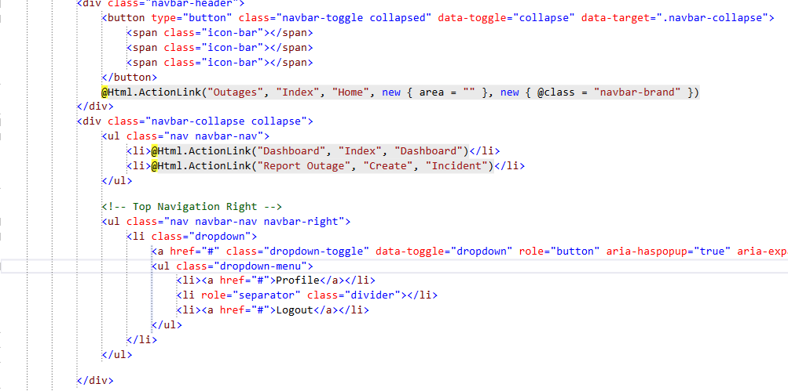
    
#### After ###:

    

1. Add a new controller called `ProfileController` to handle signins
1. Paste the following:

    ```csharp
        using DevCamp.WebApp.Utils;
        using DevCamp.WebApp.ViewModels;
        using Microsoft.Owin.Security;
        using Microsoft.Owin.Security.Cookies;
        using Microsoft.Owin.Security.OpenIdConnect;
        using Newtonsoft.Json;
        using System;
        using System.Collections.Generic;
        using System.Net.Http;
        using System.Net.Http.Headers;
        using System.Threading.Tasks;
        using System.Web;
        using System.Web.Mvc;

        namespace DevCamp.WebApp.Controllers
        {
            //BASED ON THE SAMPLE https://azure.microsoft.com/en-us/documentation/articles/active-directory-v2-devquickstarts-dotnet-web/
            //AND https://github.com/microsoftgraph/aspnet-connect-rest-sample
            //AND https://github.com/microsoftgraph/aspnet-connect-sample <--DO NOT USE Uses MSAL Preview

            public class ProfileController : Controller
            {
                // The URL that auth should redirect to after a successful login.
                Uri loginRedirectUri => new Uri(Url.Action(nameof(Index), "Profile", null, Request.Url.Scheme));
                // The URL to redirect to after a logout.
                Uri logoutRedirectUri => new Uri(Url.Action(nameof(Index), "Profile", null, Request.Url.Scheme));

                public void SignIn()
                {
                    if (!Request.IsAuthenticated)
                    {
                        // Signal OWIN to send an authorization request to Azure
                        HttpContext.GetOwinContext().Authentication.Challenge(
                        new AuthenticationProperties { RedirectUri = "/" },
                        OpenIdConnectAuthenticationDefaults.AuthenticationType);
                    }
                }

                public void SignOut()
                {
                    if (Request.IsAuthenticated)
                    {
                        // Get the user's token cache and clear it
                        string userObjId = System.Security.Claims.ClaimsPrincipal.Current
                        .FindFirst(Settings.AAD_OBJECTID_CLAIMTYPE).Value;

                        SessionTokenCache tokenCache = new SessionTokenCache(userObjId, HttpContext);
                        tokenCache.Clear();
                    }
                    // Send an OpenID Connect sign-out request. 
                    HttpContext.GetOwinContext().Authentication.SignOut(
                    CookieAuthenticationDefaults.AuthenticationType);
                    Response.Redirect("/");
                }

                [Authorize]
                //
                // GET: /UserProfile/
                public async Task<ActionResult> Index()
                {
                    UserProfileViewModel userProfile = new UserProfileViewModel();
                    try
                    {
                        string userObjId = System.Security.Claims.ClaimsPrincipal.Current.FindFirst(Settings.AAD_OBJECTID_CLAIMTYPE).Value;
                        SessionTokenCache tokenCache = new SessionTokenCache(userObjId, HttpContext);

                        string tenantId = System.Security.Claims.ClaimsPrincipal.Current.FindFirst(Settings.AAD_TENANTID_CLAIMTYPE).Value;
                        string authority = string.Format(Settings.AAD_INSTANCE, tenantId, "");
                        AuthHelper authHelper = new AuthHelper(authority, Settings.AAD_APP_ID, Settings.AAD_APP_SECRET, tokenCache);
                        string accessToken = await authHelper.GetUserAccessToken(Url.Action("Index", "Home", null, Request.Url.Scheme));

                        using (var client = new HttpClient())
                        {
                            client.DefaultRequestHeaders.Accept.Clear();
                            client.DefaultRequestHeaders.Authorization = new AuthenticationHeaderValue("Bearer", accessToken);
                            client.DefaultRequestHeaders.Accept.Add(new MediaTypeWithQualityHeaderValue("application/json"));

                            // New code:
                            HttpResponseMessage response = await client.GetAsync(Settings.GRAPH_CURRENT_USER_URL);
                            if (response.IsSuccessStatusCode)
                            {
                                string resultString = await response.Content.ReadAsStringAsync();

                                userProfile = JsonConvert.DeserializeObject<UserProfileViewModel>(resultString);
                            }
                        }
                    }
                    catch (Exception ex)
                    {
                        ViewBag.Error = "An error has occurred. Details: " + ex.Message;
                        return View();
                    }


                    return View(userProfile);
                }
            }
        }    
    ```

1. Add the Authorize attribute to the IncidentConroller classes. This will block any access to these routes until they authenticate. The application now behaves differently for anonymous vs. authenticated users, allowing you the developer flexibility in exposing pieces of your application to anonymous audiences while ensuring sensitive content stays protected.

### Exercise 2: Create a user profile page
Next, we are going to create a page to display information about the logged in user.  While AzureAD returns a name and email address, we can query the Microsoft Graph for extended details about a given user.  We will add a view, a route, and then query the Graph for user information.

1. In the profile folder, create a new file named `Index.cshtml`. Rendered with a set of attributes, we will display a simple table where each row corresponds to an attribute.

    ```csharp
    @model DevCamp.WebApp.ViewModels.UserProfileViewModel

    @{
        ViewBag.Title = "Profile";
    }


    <!-- Body -->
    <div class="container">

        <h1>User Profile</h1>

        <table class="table table-striped table-bordered">
            <tbody>
                <tr>
                    <th>Profile</th>
                    <td>https://graph.microsoft.com/v1.0/$metadata#users/$entity</td>
                </tr>
                <tr>
                    <th>id</th>
                    <td>@Html.DisplayFor(model => model.Id)</td>
                </tr>
                <tr>
                    <th>businessPhones</th>
                    @*<td>@Html.DisplayFor(model => model.BusinessPhones)</td>*@
                </tr>
                <tr>
                    <th>displayName</th>
                    <td>@Html.DisplayFor(model => model.DisplayName)</td>
                </tr>
                <tr>
                    <th>givenName</th>
                    <td>@Html.DisplayFor(model => model.GivenName)</td>
                </tr>
                <tr>
                    <th>jobTitle</th>
                    <td>@Html.DisplayFor(model => model.JobTitle)</td>
                </tr>
                <tr>
                    <th>mail</th>
                    <td>@Html.DisplayFor(model => model.Mail)</td>
                </tr>
                <tr>
                    <th>mobilePhone</th>
                    <td>@Html.DisplayFor(model => model.MobilePhone)</td>
                </tr>
                <tr>
                    <th>officeLocation</th>
                    <td>@Html.DisplayFor(model => model.OfficeLocation)</td>
                </tr>
                <tr>
                    <th>preferredLanguage</th>
                    <td>@Html.DisplayFor(model => model.PreferredLanguage)</td>
                </tr>
                <tr>
                    <th>surname</th>
                    <td>@Html.DisplayFor(model => model.Surname)</td>
                </tr>
                <tr>
                    <th>userPrincipalName</th>
                    <td>@Html.DisplayFor(model => model.UserPrincipalName)</td>
                </tr>
            </tbody>
        </table>

    </div>

    ```

1. Add code to the profile controller
1. Add code to the 

We now have a simple visualization of the current user's profile information as loaded from the Microsoft Graph.

### Exercise 3: Interact with the Microsoft Graph
In the previous exercise you read data from the Microsoft Graph, but other endpoints can be used for more sophisticated tasks.  In this exercise we will use the Graph to send an email message whenever a new incident is reported.

1. Add the constants to `setting.cs`

    ```csharp
    public static string EMAIL_MESSAGE_BODY = getEmailMessageBody();
    public static string EMAIL_MESSAGE_SUBJECT = "New Incident Reported";
    public static string EMAIL_MESSAGE_TYPE = "HTML"; 
    ```
1. Add a method to `setting.cs` generate the HTML body content for the email

    ```csharp
    static string getEmailMessageBody()
    {
        StringBuilder emailContent = new StringBuilder();
        emailContent.Append(@"<html><head><meta http-equiv='Content-Type' content='text/html; charset=us-ascii\'>");
        emailContent.Append(@"<title></title>");
        emailContent.Append(@"</head>");
        emailContent.Append(@"<body style='font-family:Calibri' > ");
        emailContent.Append(@"<div style='width:50%;background-color:#CCC;padding:10px;margin:0 auto;text-align:center;'> ");
        emailContent.Append(@"<h1>City Power &amp; Light</h1> ");
        emailContent.Append(@"<h2>New Incident was reported by {0} {1}</h2> ");
        emailContent.Append(@"<p>A new incident has been reported to the City Power &amp; Light outage system.</p> ");
        emailContent.Append(@"<br /> ");
        emailContent.Append(@"</div> ");
        emailContent.Append(@"</body> ");
        emailContent.Append(@"</html>");
        return emailContent.ToString();
    }    
    ```

1. Create a new model to represent the MailMessage structure. Add the following to the

    ```csharp
    using System;
    using System.Collections.Generic;

    namespace DevCamp.WebApp.Models
    {
        public class Body
        {
            public string contentType { get; set; }
            public string content { get; set; }
        }

        public class EmailAddress
        {
            public string name { get; set; }
            public string address { get; set; }
        }

        public class Sender
        {
            public Sender()
            {
                emailAddress = new EmailAddress();
            }
            public EmailAddress emailAddress { get; set; }
        }

        public class From
        {
            public From()
            {
                emailAddress = new EmailAddress();
            }
            public EmailAddress emailAddress { get; set; }
        }

        public class ToRecipient
        {
            public ToRecipient()
            {
                emailAddress = new EmailAddress();
            }
            public EmailAddress emailAddress { get; set; }
        }

        public class Message
        {
            public Message()
            {
                sender = new Sender();
                body = new Body();
                from = new From();
                toRecipients = new List<ToRecipient>();
            }
            public string subject { get; set; }
            public Body body { get; set; }
            public Sender sender { get; set; }
            public From from { get; set; }
            public List<ToRecipient> toRecipients { get; set; }
        }
        public class EmailMessage
        {
            public EmailMessage()
            {
                Message = new Message();
            }
            public Message Message { get; set; }
            public bool SaveToSentItems { get; set; }
        }
    }
    
    ```


Sending this email did not require the setting up of a dedicated email server, but instead leveraged capabilities within the Microsoft Graph.  We could have also created a calendar event, or a task related to the incident for a given user, all via the API.

## Summary
Our application can now distinguish between anonymous and authenticated users to ensure flexibility between public and private data.  We are also able to leverage the Microsoft Graph to not only return the user's extended user profile, but to send email confirmations whenever a new incident is created.

Copyright 2016 Microsoft Corporation. All rights reserved. Except where otherwise noted, these materials are licensed under the terms of the MIT License. You may use them according to the license as is most appropriate for your project. The terms of this license can be found at https://opensource.org/licenses/MIT.