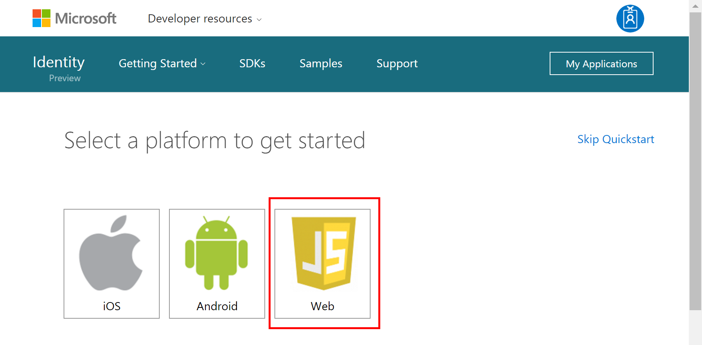
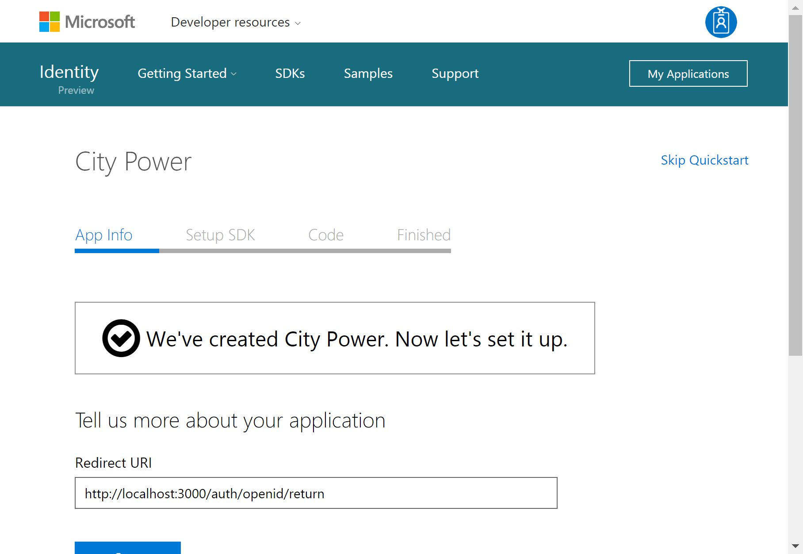
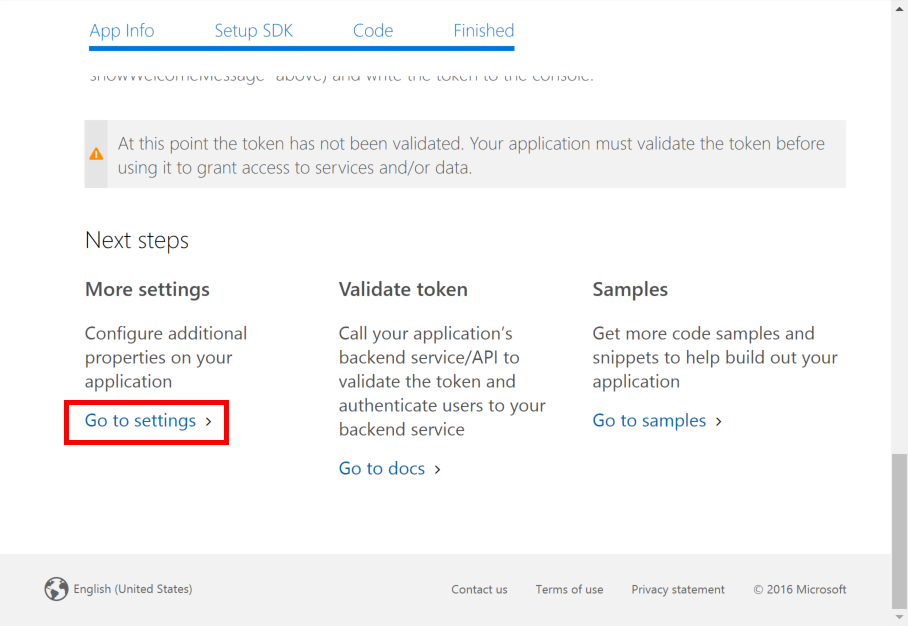
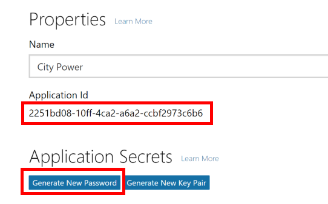
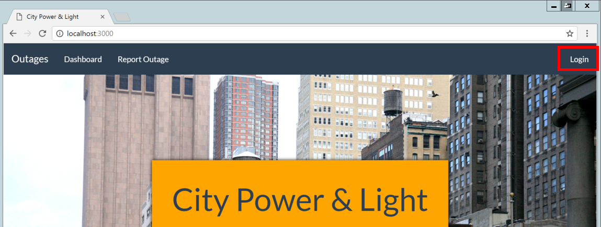
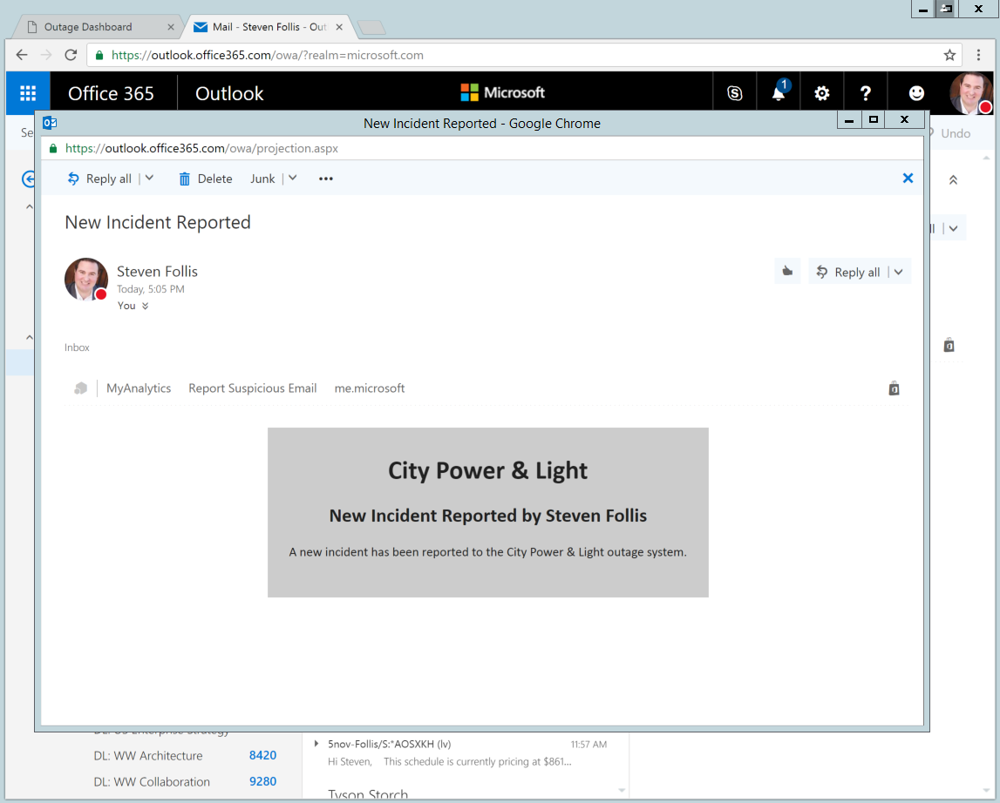

# Hands on Lab - Identity with Azure AD and Office 365 APIs (Java)

## Overview

City Power & Light is a sample application that allows citizens to to report "incidents" that have occured in their community.  It includes a landing screen, a dashboard, and a form for reporting new incidents with an optional photo.  The application is implemented with several components:

* Front end web application contains the user interface and business logic.  This component has been implemented three times in .NET, NodeJS, and Java.
* WebAPI is shared across the front ends and exposes the backend DocumentDB
* DocumentDB is used as the data persistence layer 

In this lab, you will continue enhancing the City Power & Light application by adding authentication for users powered by [Azure Active Direcotry](https://azure.microsoft.com/en-us/services/active-directory/).  Once authenticated, you may then query the [Microsoft Office Graph](https://graph.microsoft.io) to retrieve information pertinent to the aplication.

This guide uses [Eclipse STS](https://spring.io/tools) for editing, however please feel free to use your editor of choice.

## Objectives
In this hands-on lab, you will learn how to:

* Take an anonymous application and add user authentication via AzureAD
* Query data from the Microsoft Graph
* Manipulate data in the Microsoft Graph

## Prerequisites

* The source for the starter app is located in the `HOL\node\azuread-office365\start` folder. 
* The finished project is located in the `HOL\node\azuread-office365\end` folder. 
* Deployed the starter ARM Template
* Completion of the first modern-apps lab

## Exercises

This hands-on-lab has the following exercises:

* Exercise 1: Setup authentication 
* Exercise 2: Create a user profile page
* Exercise 3: Send a confirmation email to the user on incident creation

## Exercise 1: Integrate the API

AzureAD can handle authentication for web applications. First we will create a new application in our AzureAD directory, and then we will extend our application code to work with an authentication flow. 

1. Navigate in a browser to `https://apps.dev.microsoft.com`, click the button to **Register your app**, and login with your Azure credentials.

    

1. There are several types of application that can be registered.  For City Power & Light, select **Web Application**

    

1. Provide an application name and contact email address.

    

1. After AzureAD handles the authentication, it needs a route in our application to redirect the user.  
For testing locally, we'll use `http://localhost:8080/auth/openid/return` as the **Redirect URI** and 
as an environment variable named `AAD_RETURN_URL`.  Click the **Create** button. 

    

1. The page then shows some sample code. Scroll down to the bottom and select **Go to settings**

    

1. On the Registration page, take note of the **Application ID**. This will be used as an environment variable named `AAD_CLIENT_ID` and is used to configure the authentication library.  

    We also need to generate a client secret. Select the **Generate New Password** button.

    

1. A key is generated for you. Save this, as you will not be able to retrieve it in the future. This key will become the `AAD_CLIENT_SECRET` environment variable.

    

1. In Eclipse, let's add those environment variables by opening the run environment, click on the environment tab, and clicking `new` (using the values you captured above):

    ```
    "AAD_RETURN_URL": "http://localhost:3000/auth/openid/return",
    "AAD_CLIENT_ID": "2251bd08-10ff-4ca2-a6a2-ccbf2973c6b6",
    "AAD_CLIENT_SECRET": "JjrKfgDyo5peQ4xJa786e8z"
    "AAD_TENANT_ID": "JjrKfgDyo5peQ4xJa786e8z"
    ```

1. To add AAD identity support libraries to your Spring application, open the build.gradle
   file and add the following entries under dependencies:
   ```java
	compile('com.microsoft.azure:adal4j:1.1.1')
	compile('com.nimbusds:oauth2-oidc-sdk:4.5')
	compile('org.springframework.security:spring-security-core')
	compile('org.springframework.security:spring-security-web')
	compile('org.springframework.security:spring-security-config')
    ```

    To make sure that Eclipse knows about the new packages we added to
    the buld, run the `ide/eclipse` gradle task in the `gradle tasks`
    window. When that is done, right-click on the project in the project explorer,
    close the project, and then open it again.


1. The Spring security features can be rather complex, however we are going to take a simplistic 
route with this example.  We are going to create two security filters, one for requesting Azure 
AD Authentication, and the other to process the Azure AD response.  These filters work in conjunction 
with Spring security to allow flexible security requirements for pages in the application.

First, create a class `devCamp.WebApp.AzureADAuthenticationFilter.java`, and paste this code into it:

    ```java
    package devCamp.WebApp;

    import java.io.IOException;
    import java.io.UnsupportedEncodingException;
    import java.net.URLEncoder;
    import java.util.Arrays;
    import java.util.Date;
    import java.util.HashSet;
    import java.util.UUID;
    import java.util.concurrent.ExecutionException;
    import java.util.concurrent.ExecutorService;
    import java.util.concurrent.Executors;
    import java.util.concurrent.Future;

    import javax.naming.ServiceUnavailableException;
    import javax.servlet.FilterChain;
    import javax.servlet.ServletException;
    import javax.servlet.http.HttpServletRequest;
    import javax.servlet.http.HttpServletResponse;

    import org.slf4j.Logger;
    import org.slf4j.LoggerFactory;
    import org.springframework.security.core.context.SecurityContextHolder;
    import org.springframework.security.web.csrf.CsrfToken;
    import org.springframework.web.filter.OncePerRequestFilter;

    import com.microsoft.aad.adal4j.AuthenticationContext;
    import com.microsoft.aad.adal4j.AuthenticationResult;
    import com.microsoft.aad.adal4j.ClientCredential;

    import devCamp.WebApp.Utils.AuthHelper;
    import org.springframework.security.web.util.matcher.RequestMatcher;

    public class AzureADAuthenticationFilter extends OncePerRequestFilter {

        private static Logger log = LoggerFactory.getLogger(AzureADAuthenticationFilter.class);

        private String clientId = "9f9967cf-2f4c-4413-9075-3b5b6bbd90dd";
        private String clientSecret = "cS8aIzFM3XgsCEAmE0ctVio6ySjOwmQp25q9RXBYtr4=";
        private String tenant = "86bea8f4-503f-46f2-ba4e-befba8ae383a";
        private String authority = "https://login.microsoftonline.com/";
        private String returnURL = "";

        public AzureADAuthenticationFilter() {
            super();
            this.clientId = System.getenv("AAD_CLIENT_ID");
            this.clientSecret = System.getenv("AAD_CLIENT_SECRET");
            this.tenant = System.getenv("AAD_TENANT_ID");
            this.authority = "https://login.microsoftonline.com/";
            this.returnURL = System.getenv("AAD_RETURN_URL");
        }

        public static final RequestMatcher DEFAULT_AAD_MATCHER = new DefaultAADAuthenticationMatcher();
        private RequestMatcher requireAADAuthenticationMatcher = DEFAULT_AAD_MATCHER;
            
        @Override
        protected void doFilterInternal(HttpServletRequest request, HttpServletResponse response, FilterChain filterChain)
                throws ServletException, IOException {
            try {

                String currentUri = request.getScheme() + "://" + request.getServerName()
                        + ("http".equals(request.getScheme()) && request.getServerPort() == 80
                                || "https".equals(request.getScheme()) && request.getServerPort() == 443 ? ""
                                        : ":" + request.getServerPort())
                        + request.getRequestURI();

                if (this.requireAADAuthenticationMatcher.matches(request)){
                    filterChain.doFilter(request, response);
                    return;
                }
                // check if user has a session
                if (!AuthHelper.isAuthenticated(request)) {

                    log.info("AuthHelper.isAuthenticated = false");

                    if (AuthHelper.containsAuthenticationData(request)) {
                        // handled previously already...
                    } else {
                        log.info("AuthHelper.containsAuthenticationData = false");

                        // when not authenticated and request does not contains authentication data (not come from Azure AD login process),
                        // redirect to Azure login page.

                        // get csrf token
                        CsrfToken token = (CsrfToken) request.getAttribute("_csrf");
                        log.info("current csrf token before going to AzureAD login {} {} = {}", token.getHeaderName(), token.getParameterName(), token.getToken());

                        // add the csrf token to login request and go login...
                        response.setStatus(302);
                        String redirectTo = getRedirectUrl(currentUri);
                        redirectTo += "&state=" + token.getToken();

                        log.info("302 redirect to " + redirectTo);

                        response.sendRedirect(redirectTo);
                        return;
                    }
                } else {
                    log.info("AuthHelper.isAuthenticated = true");

                    // if authenticated, how to check for valid session?
                    AuthenticationResult result = AuthHelper.getAuthSessionObject(request);

                    if (request.getParameter("refresh") != null) {
                        result = getAccessTokenFromRefreshToken(result.getRefreshToken(), currentUri);
                    } else {
                        if (request.getParameter("cc") != null) {
                            result = getAccessTokenFromClientCredentials();
                        } else {
                            if (result.getExpiresOnDate().before(new Date())) {
                                result = getAccessTokenFromRefreshToken(result.getRefreshToken(), currentUri);
                            }
                        }
                    }
                    createSessionPrincipal(request, result);

                    // handle logout
                    log.info("URI: " + request.getRequestURI());
                    if ("/logout".equals(request.getRequestURI())) {
                        log.info("logout...");

                        // clear spring security context so spring thinks this user is gone.
                        request.logout();
                        SecurityContextHolder.clearContext();

                        // clear Azure principal
                        request.getSession().setAttribute(AuthHelper.PRINCIPAL_SESSION_NAME, null);

                        // go to AzureAD and logout.
                        response.setStatus(302);
                        //String logoutPage = "https://login.windows.net/" + BasicFilter.tenant + "/oauth2/logout?post_logout_redirect_uri=https://login.windows.net/";
                        String logoutPage = "https://login.windows.net/" + AzureADAuthenticationFilter.tenant + "/oauth2/logout";
                        log.info("302 redirect to " + logoutPage);

                        response.sendRedirect(logoutPage);
                        return;
                    }
                }
            } catch (Throwable exc) {
                response.setStatus(500);
                request.setAttribute("error", exc.getMessage());
                response.sendRedirect(((HttpServletRequest) request).getContextPath() + "/error.jsp");
            }
            log.info("doFilter");
            filterChain.doFilter(request, response);
        }

        private AuthenticationResult getAccessTokenFromClientCredentials() throws Throwable {
            AuthenticationContext context = null;
            AuthenticationResult result = null;
            ExecutorService service = null;
            try {
                service = Executors.newFixedThreadPool(1);
                context = new AuthenticationContext(authority + tenant + "/", true, service);
                Future<AuthenticationResult> future = context.acquireToken("https://graph.windows.net",
                        new ClientCredential(clientId, clientSecret), null);
                result = future.get();
            } catch (ExecutionException e) {
                throw e.getCause();
            } finally {
                service.shutdown();
            }

            if (result == null) {
                throw new ServiceUnavailableException("authentication result was null");
            }
            return result;
        }

        private AuthenticationResult getAccessTokenFromRefreshToken(String refreshToken, String currentUri)
                throws Throwable {
            AuthenticationContext context = null;
            AuthenticationResult result = null;
            ExecutorService service = null;
            try {
                service = Executors.newFixedThreadPool(1);
                context = new AuthenticationContext(authority + tenant + "/", true, service);
                Future<AuthenticationResult> future = context.acquireTokenByRefreshToken(refreshToken,
                        new ClientCredential(clientId, clientSecret), null, null);
                result = future.get();
            } catch (ExecutionException e) {
                throw e.getCause();
            } finally {
                service.shutdown();
            }

            if (result == null) {
                throw new ServiceUnavailableException("authentication result was null");
            }
            return result;

        }

        private void createSessionPrincipal(HttpServletRequest httpRequest, AuthenticationResult result) throws Exception {

            log.info("create session principal: " + result.getUserInfo().getDisplayableId());

            httpRequest.getSession().setAttribute(AuthHelper.PRINCIPAL_SESSION_NAME, result);
        }

        private String getRedirectUrl(String currentUri) throws UnsupportedEncodingException {
            String redirectUrl = authority + tenant
                    + "/oauth2/authorize?response_type=code%20id_token&scope=openid&response_mode=form_post&redirect_uri="
                    + URLEncoder.encode(currentUri, "UTF-8") + "&client_id=" + clientId
                    + "&resource=https%3a%2f%2fgraph.windows.net" + "&nonce=" + UUID.randomUUID() + "&site_id=500879";
            return redirectUrl;
        }
        
        public void setAADAuthenticationMatcher(RequestMatcher matcher) {
            requireAADAuthenticationMatcher = matcher;
        }
        
        private static final class DefaultAADAuthenticationMatcher implements RequestMatcher  {
            private final HashSet<String> allowedMethods = new HashSet<String> (
                    Arrays.asList("GET","HEAD","TRACE","OPTIONS"));
            @Override
            public boolean matches(HttpServletRequest request) {
                return !this.allowedMethods.contains(request.getMethod());
            }	
        }
    }
    ```

    This is a Spring security fiter that will make sure the user is authenticated on pages
    that require it.  If the user needs authentication, they will be redirected to the login
    page to get the requred token.  

1. When the user completes their login, the browser will be redirected back to the same
    page, but with an HTTP post and the token attached.  We need to create a class to catch 
    that post.  Create a new java class named `devCamp.WebApp.AzureADResponseFilter.java` 
    and paste in this code:

    ```Java
    Package devCamp.WebApp;

    import java.io.IOException;
    import java.net.URI;
    import java.util.HashMap;
    import java.util.Map;
    import java.util.concurrent.ExecutionException;
    import java.util.concurrent.ExecutorService;
    import java.util.concurrent.Executors;
    import java.util.concurrent.Future;

    import javax.naming.ServiceUnavailableException;
    import javax.servlet.FilterChain;
    import javax.servlet.ServletException;
    import javax.servlet.http.HttpServletRequest;
    import javax.servlet.http.HttpServletRequestWrapper;
    import javax.servlet.http.HttpServletResponse;

    import org.slf4j.Logger;
    import org.slf4j.LoggerFactory;
    import org.springframework.security.core.Authentication;
    import org.springframework.security.core.context.SecurityContextHolder;
    import org.springframework.security.web.authentication.preauth.PreAuthenticatedAuthenticationToken;
    import org.springframework.web.filter.OncePerRequestFilter;

    import com.microsoft.aad.adal4j.AuthenticationContext;
    import com.microsoft.aad.adal4j.AuthenticationResult;
    import com.microsoft.aad.adal4j.ClientCredential;
    import com.nimbusds.oauth2.sdk.AuthorizationCode;
    import com.nimbusds.openid.connect.sdk.AuthenticationErrorResponse;
    import com.nimbusds.openid.connect.sdk.AuthenticationResponse;
    import com.nimbusds.openid.connect.sdk.AuthenticationResponseParser;
    import com.nimbusds.openid.connect.sdk.AuthenticationSuccessResponse;

    import devCamp.WebApp.Utils.AuthHelper;

    public class AzureADResponseFilter extends OncePerRequestFilter {

        private static Logger log = LoggerFactory.getLogger(AzureADResponseFilter.class);

        public static final String clientId = "9f9967cf-2f4c-4413-9075-3b5b6bbd90dd";
        public static final String clientSecret = "cS8aIzFM3XgsCEAmE0ctVio6ySjOwmQp25q9RXBYtr4=";
        public static final String tenant = "86bea8f4-503f-46f2-ba4e-befba8ae383a";
        public static final String authority = "https://login.microsoftonline.com/";
        
        private String csrfToken;

        @Override
        protected void doFilterInternal(HttpServletRequest request, HttpServletResponse response, FilterChain filterChain)
                throws ServletException, IOException {

            try {


                String currentUri = request.getScheme() + "://" + request.getServerName()
                        + ("http".equals(request.getScheme()) && request.getServerPort() == 80
                                || "https".equals(request.getScheme()) && request.getServerPort() == 443 ? ""
                                        : ":" + request.getServerPort())
                        + request.getRequestURI();

                String fullUrl = currentUri + (request.getQueryString() != null ? "?" + request.getQueryString() : "");

                log.info("URL: " + fullUrl);

                csrfToken = null;

                // check if user has a session
                if (!AuthHelper.isAuthenticated(request) && AuthHelper.containsAuthenticationData(request)) {

                    // when not authenticated and the response contains authentication data,
                    // this request came from AzureAD login page.

                    log.info("AuthHelper.isAuthenticated = false && AuthHelper.containsAuthenticationData = true");

                    Map<String, String> params = new HashMap<String, String>();
                    for (String key : request.getParameterMap().keySet()) {
                        params.put(key, request.getParameterMap().get(key)[0]);
                    }

                    AuthenticationResponse authResponse = AuthenticationResponseParser.parse(new URI(fullUrl), params);
                    log.info("authResponse = " + authResponse);

                    if (AuthHelper.isAuthenticationSuccessful(authResponse)) {

                        // when authentication result from Azure AD is success,
                        // retrieve the state (which is our csrf token) and store it to request header.
                        // spring csrf filter reads this token in request header.

                        log.info("AuthHelper.isAuthenticationSuccessful = true");

                        AuthenticationSuccessResponse oidcResponse = (AuthenticationSuccessResponse) authResponse;
                        AuthenticationResult result = getAccessToken(oidcResponse.getAuthorizationCode(), currentUri);

                        // the state is our csrf token.
                        log.info("state = " + oidcResponse.getState());
                        csrfToken = oidcResponse.getState().getValue();

                        // store authenticated principal to spring security context holder.
                        Authentication anAuthentication = new PreAuthenticatedAuthenticationToken(result.getUserInfo(), null);
                        anAuthentication.setAuthenticated(true);
                        SecurityContextHolder.getContext().setAuthentication(anAuthentication);

                        log.info("SecurityContextHolder.getContext().getAuthentication() = " + SecurityContextHolder.getContext().getAuthentication());

                        // store authentication data to Azure AD API. (in session)
                        createSessionPrincipal(request, result);
                    } else {
                        log.info("AuthHelper.isAuthenticationSuccessful = false");

                        AuthenticationErrorResponse oidcResponse = (AuthenticationErrorResponse) authResponse;
                        throw new Exception(String.format("Request for auth code failed: %s - %s",
                                oidcResponse.getErrorObject().getCode(),
                                oidcResponse.getErrorObject().getDescription()));
                    }
                }
            } catch (Throwable exc) {
                response.setStatus(500);
                request.setAttribute("error", exc.getMessage());
                response.sendRedirect(((HttpServletRequest) request).getContextPath() + "/error.jsp");
            }

            if (csrfToken != null) {
                // if required, set csrf token to request header.
                log.info("create a dummy request and put csrf token in its header {}", csrfToken);
                filterChain.doFilter(new HttpServletRequestWrapper(request) {

                    @Override
                    public String getHeader(String name) {
                        if ("X-CSRF-TOKEN".equals(name)) {
                            log.info("read csrf token from request header: {}", csrfToken);
                            log.info("   request method {}", request.getMethod());
                            return csrfToken;
                        }
                        return super.getHeader(name);
                    }
                    @Override
                    public String getMethod() {
                        return "GET";
                    }
                }, response);
            } else {
                // in regular cases, do nothing.
                log.info("continue on with filter");
                filterChain.doFilter(request, response);
            }
        }

        private AuthenticationResult getAccessToken(AuthorizationCode authorizationCode, String currentUri)
                throws Throwable {
            String authCode = authorizationCode.getValue();
            ClientCredential credential = new ClientCredential(clientId, clientSecret);
            AuthenticationContext context = null;
            AuthenticationResult result = null;
            ExecutorService service = null;
            try {
                service = Executors.newFixedThreadPool(1);
                context = new AuthenticationContext(authority + tenant + "/", true, service);
                Future<AuthenticationResult> future = context.acquireTokenByAuthorizationCode(authCode, new URI(currentUri),
                        credential, null);
                result = future.get();
            } catch (ExecutionException e) {
                throw e.getCause();
            } finally {
                service.shutdown();
            }

            if (result == null) {
                throw new ServiceUnavailableException("authentication result was null");
            }
            return result;
        }

        private void createSessionPrincipal(HttpServletRequest httpRequest, AuthenticationResult result) throws Exception {

            log.info("create session principal: " + result.getUserInfo().getDisplayableId());

            httpRequest.getSession().setAttribute(AuthHelper.PRINCIPAL_SESSION_NAME, result);
        }
    }
    
    ```
1. These classes need a "helper" class to do some utility functions. Create the class `devCamp.WebApp.Utils.AuthHelper.java`, and paste in the following code:
    ```Java
    package devCamp.WebApp.Utils;

    import javax.servlet.http.HttpServletRequest;
    import com.microsoft.aad.adal4j.AuthenticationResult;
    import com.nimbusds.openid.connect.sdk.AuthenticationResponse;
    import com.nimbusds.openid.connect.sdk.AuthenticationSuccessResponse;

    public final class AuthHelper {

        public static final String PRINCIPAL_SESSION_NAME = "principal";

        public static boolean isAuthenticated(HttpServletRequest request) {
            return request.getSession().getAttribute(PRINCIPAL_SESSION_NAME) != null;
        }

        public static AuthenticationResult getAuthSessionObject(HttpServletRequest request) {
            return (AuthenticationResult) request.getSession().getAttribute(PRINCIPAL_SESSION_NAME);
        }

        public static boolean containsAuthenticationData(HttpServletRequest httpRequest) {
            return httpRequest.getMethod().equalsIgnoreCase("POST")
                    && (httpRequest.getParameterMap().containsKey(AuthParameterNames.ERROR)
                            || httpRequest.getParameterMap().containsKey(AuthParameterNames.ID_TOKEN)
                            || httpRequest.getParameterMap().containsKey(AuthParameterNames.CODE));
        }

        public static boolean isAuthenticationSuccessful(AuthenticationResponse authResponse) {
            return authResponse instanceof AuthenticationSuccessResponse;
        }
    }
    
    ```     

1. Next create `devCamp.WebApp.Utils.AuthParameterNames.java` with this content:
    ```Java
    package devCamp.WebApp.Utils;

    public final class AuthParameterNames {

        public static String ERROR = "error";
        public static String ERROR_DESCRIPTION = "error_description";
        public static String ERROR_URI = "error_uri";
        public static String ID_TOKEN = "id_token";
        public static String CODE = "code";
    }    
    ```
1. Next, we need a class to configure security for our application.  
Create `devCamp.WebApp.WWebSecurityConfig.java` with the following code:

    ```Java
    package devCamp.WebApp;

    import java.io.IOException;

    import javax.servlet.Filter;
    import javax.servlet.FilterChain;
    import javax.servlet.ServletException;
    import javax.servlet.http.HttpServletRequest;
    import javax.servlet.http.HttpServletResponse;

    import org.slf4j.Logger;
    import org.slf4j.LoggerFactory;
    import org.springframework.security.config.annotation.web.builders.HttpSecurity;
    import org.springframework.security.config.annotation.web.configuration.EnableWebSecurity;
    import org.springframework.security.config.annotation.web.configuration.WebSecurityConfigurerAdapter;
    import org.springframework.security.web.csrf.CsrfFilter;
    import org.springframework.security.web.util.matcher.AntPathRequestMatcher;
    import org.springframework.security.web.util.matcher.OrRequestMatcher;
    import org.springframework.security.web.util.matcher.RequestMatcher;
    import org.springframework.web.filter.OncePerRequestFilter;

    @EnableWebSecurity
    public class WebSecurityConfig extends WebSecurityConfigurerAdapter {

        private static Logger log = LoggerFactory.getLogger(WebSecurityConfig.class);

        @Override
        protected void configure(HttpSecurity http) throws Exception {

            RequestMatcher resourcesMatcher = new AntPathRequestMatcher("/resources/**");
            RequestMatcher postLoginMatcher = new AntPathRequestMatcher("/login", "POST");
            RequestMatcher dashboardMatcher = new AntPathRequestMatcher("/dashboard/**");
            RequestMatcher indexMatcher = new AntPathRequestMatcher("/");
            RequestMatcher ignored = new OrRequestMatcher(resourcesMatcher, postLoginMatcher,dashboardMatcher,indexMatcher);

            AzureADAuthenticationFilter delegateFilter = new AzureADAuthenticationFilter();
            delegateFilter.setAADAuthenticationMatcher(ignored);

            http.addFilterBefore(new AzureADResponseFilter(), CsrfFilter.class);
            http.addFilterAfter(delegateFilter, CsrfFilter.class);

            http.authorizeRequests().antMatchers("/dashboard**").permitAll()
            .antMatchers("/").permitAll()
            .antMatchers("/static/**").permitAll()
            .antMatchers("/images/**").permitAll()
            .antMatchers("/details/**").permitAll()
            .antMatchers("/new/**").authenticated();

        }

        class DelegateRequestMatchingFilter extends OncePerRequestFilter {
            private Filter delegate;
            private RequestMatcher ignoredRequests;

            public DelegateRequestMatchingFilter(RequestMatcher matcher, Filter delegate) {
                this.ignoredRequests = matcher;
                this.delegate = delegate;
            }

            public void setIgnoredMatcher(RequestMatcher matcher) {
                this.ignoredRequests = matcher;
            }

            @Override
            protected void doFilterInternal(HttpServletRequest request, HttpServletResponse response,
                    FilterChain filterChain) throws ServletException, IOException {
                if( ignoredRequests.matches(request)) {
                    filterChain.doFilter(request,response);
                } else {
                    delegate.doFilter(request,response,filterChain);
                }
            }
        } 
    }
    ```

1. Our backend code is taking shape, but we need the user interface to display a **Login** button.  Open up `views/navigation.pug` and remove the commented out blocks of code by deleting the `//-` characters. Now load the application in the browser and you should see the **Login** button on the top navigation.

    

    Click on the link for **Report Outage**. Since you are not currently authenticated, the application redirects you to Azure to provide a username and apssword.  Sign in, and you will be redirect back to the homescreen with a username in the top right corner. Click the name to dropdown a link for a **Profile** page and to **Sign Out**.  

    

The application now behaves differently for anonymous vs. authenticated users, allowing you the developer flexibility in exposing pieces of your application to anonymous audiences while ensuring sensitive content stays protected.

## Exercise 2: Create a user profile page
Next, we are goign to create a page to display information about the logged in user.  While AzureAD returns a name and email address, we can query the Microsoft Graph for extended details about a given user.  We will add a view, a route, and then query the Graph for user information.

1. Create a new file named `views/profile.pug`. Rendered with a set of attributes, we will display a simple table where each row corresponds to an attribute.

    ```pug
    extends layout

    block content

        .container
            h1 User Profile

            if attributes
                table.table.table-striped.table-bordered
                    each key, value in attributes
                        tr
                            th= value
                            td= key
    ```

1. With the view prepped, create a route at `routes/profile.js`.  When the route is loaded, it will query the Microsoft Graph "Me" endpoint.  This query requires a token to be passed in an `authorization` request header, which we grab from the `user` object provided by Passport.

    ```javascript
    var express = require('express');
    var router = express.Router();
    var request = require('request');
    var authUtility = require('../utilities/auth');

    /* GET profile page. */
    router.get('/', authUtility.ensureAuthenticated, function (req, res) {

        // Create options object configuring the HTTP call
        var options = {
            url: 'https://graph.microsoft.com/v1.0/me',
            method: 'GET',
            json: true,
            headers: {
                authorization: 'Bearer ' + req.user.token
            }
        };

        // Query Graph API
        request(options, function (error, results, body) {

            // Render page with returned attributes
            res.render('profile', {
                title: 'Profile',
                user: req.user,
                attributes: body
            });

        });

    });

    module.exports = router;
    ```

1. With the view and route created, we can now load `http://localhost:3000/profile` in the browser.

    

We now have a simple visualization of the current user's profile information as loaded from the Microsoft Graph.

## Exercise 3: Interact with the Microsoft Graph
In the previous exercise you read data from the Microsoft Graph, but other endpoints can be used for more sophisticated tasks.  In this exercise we will use the Graph to send an email message whenever a new incident is reported.

1. Create a new file in `utilities/mail.js` that will take a recipient and generate a JSON message body for passing into the Graph API. 

    ```javascript
    // https://graph.microsoft.io/en-us/docs/api-reference/v1.0/api/user_post_messages

    // The contents of the outbound email message that will be sent to the user
    var emailContent = `
    <html>

    <head>
    <meta http-equiv='Content-Type' content='text/html; charset=us-ascii\'>
    <title></title>
    </head>

    <body style="font-family:Calibri">
    <div style="width:50%;background-color:#CCC;padding:10px;margin:0 auto;text-align:center;">
        <h1>City Power &amp; Light</h1>
        <h2>New Incident Reported by {{name}}</h2>
        <p>A new incident has been reported to the City Power &amp; Light outage system.</p>   
        <br />
    </div>
    </body>

    </html>
    `;

    /**
    * Returns the outbound email message content with the supplied name populated in the text
    * @param {string} name The proper noun to use when addressing the email
    * @return {string} the formatted email body
    */
    function getEmailContent(name) {
        return emailContent.replace('{{name}}', name);
    }

    /**
    * Wraps the email's message content in the expected [soon-to-deserialized JSON] format
    * @param {string} content the message body of the email message
    * @param {string} recipient the email address to whom this message will be sent
    * @return the message object to send over the wire
    */
    function wrapEmail(content, recipient) {
        var emailAsPayload = {
            Message: {
                Subject: 'New Incident Reported',
                Body: {
                    ContentType: 'HTML',
                    Content: content
                },
                ToRecipients: [
                    {
                        EmailAddress: {
                            Address: recipient
                        }
                    }
                ]
            },
            SaveToSentItems: true
        };
        return emailAsPayload;
    }

    /**
    * Delegating method to wrap the formatted email message into a POST-able object
    * @param {string} name the name used to address the recipient
    * @param {string} recipient the email address to which the connect email will be sent
    */
    function generateMailBody(name, recipient) {
        return wrapEmail(getEmailContent(name), recipient);
    }

    module.exports.generateMailBody = generateMailBody; 
    ```

    > There are [numerous settings](https://graph.microsoft.io/en-us/docs/api-reference/v1.0/api/user_post_messages) you can include in a mail message

1. Extend `routes/new.js` to call our helper by adding a new function after the end of `function uploadImage()` and before the module export statement.

    ```javascript
    function emailConfirmation(user) {

        return new Promise(function (resolve, reject) {

            // Generate email markup
            var mailBody = emailUtility.generateMailBody(user.displayName, user.email);

            // Set configuration options
            var options = {
                url: 'https://graph.microsoft.com/v1.0/me/sendMail',
                json: true,
                method: 'POST',
                headers: {
                    'Authorization': 'Bearer ' + user.token
                },
                body: mailBody
            };

            // POST new message to Graph API
            request(options, function (error, response) {

                console.log('Email confirmation message sent.');
                resolve();

            });

        });

    }

    ```

    Also update the series of chained promises in the original `.post` to include a reference to the new `emailConfirmation` function

    ```javascript
    // Process the fields into a new incident, upload image, and add thumbnail queue message
    createIncident(fields, files)
        .then(uploadImage)
        .then(addQueueMessage)
        .then(emailConfirmation(req.user))
        .then(() => {

            // Successfully processed form upload
            // Redirect to dashboard
            res.redirect('/dashboard');

        });
    ```

    Finally, add a reference at the top of the page for `var emailUtility = require('../utilities/email');`

 1. Load the application in the browser, and create a new incident.  You should soon receive an email in the current user's inbox.

           

Sending this email did not require the setting up of a dedicated email server, but instead leveraged capabilities within the Microsfot Graph.  We could have also created a calendar event, or a task related to the incident for a given user, all via the API.

## Summary
Our application can now bifurcate anonymous and authenticated users to ensure flexibility between public and private data.  We are also able to leverage the Microsoft Graph to not only return the user's extended user profile, but to send email confirmations whenever a new incident is created.